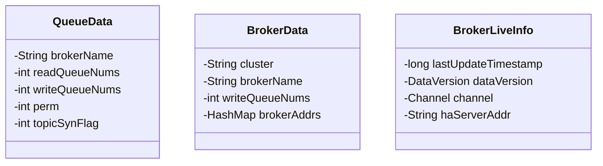

# 第1节 NameServer的启动原理


> 一般了解 RocketMQ 的读者都知道，NameServer 是 RocketMQ 的组织协调者，是 RocketMQ 对外提供服务的“大脑”。NameServer 提供了路由管理，服务注册与服务发现等机制，是保证消息正确地从生产者到消费者的“指挥官”。那么，生产者生产的消息是如何正确地被消费者消费的呢？Broker 的宕机是如何被生产者和消费者感知的呢？RocketMQ 对外提供服务的可靠性是如何保障的呢？带着这几个问题，我们一起去深入了解RocketMQ NameServer 的设计原理及实现吧！文中的代码仓库地址：[点击跳转](https://github.com/itlemon/rocketmq-5.0.0)。

## 一、NameServer的基本原理

我们熟知的几种常见的消息队列组件，比如 Kafka，ActiveMQ，RabbitMQ 等，都是一种基于主题的发布订阅机制，RocketMQ 也正是基于这种机制实现的消息服务。消息生产者（Producer）将生产好的消息发布到某个主题，该主题下的消息在消息服务器（Broker）中进行传送或存储，由消费者（Consumer）进行订阅主题，从消息服务器中获取到消息后进行消费。

消费者获取消息的方式通常有两种，一种是主动去消息服务器拉取消息（Pull Message），另外一种是由消息服务器推送消息（Push Message）给消费者。这种主题的发布订阅机制应用到分布式系统中，成功解耦了生产者和消费者。既然是分布式系统，那么常常存在分布式系统问题，比如某个消息服务器宕机了，生产者是如何感知这台消息服务器宕机了，从而避免将消息发送到这台消息服务器上，消费者是如何感知这台消息服务器宕机了，从而避免从这台消息服务器上拉取消息的呢？且这台宕机的消息服务器是如何从消息服务器实例列表中被剔除的呢？这一切都将归功于 NameServer，它的诞生让动态感知、动态剔除、负载均衡成为可能。

下图是 RocketMQ 常见的物理部署图（图片来源：百度图库），采用的部署方式2m-2s（2Master，2Slave），这个部署结构在 RocketMQ 4.x 中也是常用的，本文暂时将不会去过多介绍 RocketMQ 5.0 的新部署结构，后续将有专门的文章去阐述。本小节将根据此图阐述 RocketMQ 基本的流程原理，后面的小节将深入源码中，从源码中来验证基本流程原理。


文章一开始就说道，NameServer 是整个 RocketMQ 消息服务系统的“大脑”，是指挥消息正确发送、消费的“指挥官”，那么他是如何完成这样完美的指挥任务的呢？

NameServer 被设计为一种无状态的服务注册发现中心，在 NameServer 集群中，各个 NameServer 之间是无感知，无通信的独立节点，任何一个 NameServer 节点挂掉，都不影响整体的消息服务。

Broker 在启动的时候，会向指定的 NameServer 列表中的每个 NameServer 注册，发送自身的元信息到每个 NameServer 中，这些元信息包含但不限于 BrokerName，BrokerAddress，Broker 端口，集群信息，Topic 等信息，这些元信息将保存在 NameServer 的路由信息管理器（RouteInfoManager）中。

当消息生产者在将生产的消息发送出去之前，会从 NameServer 中拉取 Broker 的信息列表，然后通过负载均衡算法从中选择一个 Broker 服务器将消息发送出去。当消息消费者要消费消息之前，也会去 NameServer 中拉取 Broker 的信息列表，从而从 Broker 中获取可消费的消息。

Broker 在首次启动会向 NameServer 注册元信息，启动后也会定期向 NameServer 发送心跳，这个周期默认是 $30$ 秒，当然这个周期可以自定义，支持范围是 $10$ 秒到 $60$ 秒之间，每次心跳发送的数据包都是该 Broker 的元数据信息。

NameServer 也有自动检测能力，NameServer 启动后会注册一个定时任务线程池，默认每隔 $5$ 秒（RocketMQ 4.x 默认是 $10$ 秒）会自动扫描 Broker 列表，对于不再存活的 Broker，将做剔除处理。这动态维护路由信息的能力，并不包含动态通知消息生产者，也就是说生产者并不会及时感知到非存活状态 Broker 被剔除，但是这并不影响消息的正确发送，因为生产者自身提供有容错机制来保证消息的正常发送。

消费者与 NameServer 没有保持长连接，而是每 $30$ 秒从 NameServer 获取所有 Topic 的信息列表，如果某个时刻某个 Broker 宕机，消费者可能需要 $30$ 秒才能知道这个宕机的 Broker 是哪一个，当然这个值也是可以在配置文件中配置的，可根据实际业务来配置该值。消费者在感知 Broker 存活这一块，有自己的机制，比如每 $30$ 秒向 Broker 发送心跳，且 Broker 每 $10$ 秒会检测与消费者的连接情况，若某个连接 $2$ 分钟内（当前时间与最后更新时间差值超过 $2$ 分钟)没有发送心跳数据，则关闭连接，并向该消费者分组的所有消费者发出通知，分组内消费者重新分配队列继续消费。

## 二、NameServer的启动流程原理

在《[RocketMQ源码之路（一）搭建RocketMQ源码环境](1-2RocketMQ源码阅读环境搭建.md)》中，我们了解了如何使用 IDE 启动 NameServer，那么本小节将和大家一起探讨 NameServer 的启动流程原理，我们将从 NameServer 的启动类 NamesrvStartup 开始，和大家一起来阅读 NameServer 的启动源码，帮助大家理解 NameServer 的启动流程。

NameServer 的启动类 NamesrvStartup 的 main 方法（`org.apache.rocketmq.namesrv.NamesrvStartup#main`）如下所示：

```java
public class NamesrvStartup {

    private static InternalLogger log;

    /**
     * 解析命令行参数和配置文件参数，装配到该属性中进行存储，它存储全部的配置k-v，包含-c指定的启动文件和-p打印出来的变量
     */
    private static Properties properties = null;

    /**
     * NameServer配置项：从properties中解析出来的全部NameServer配置
     */
    private static NamesrvConfig namesrvConfig = null;

    /**
     * NettyServer的配置项：从properties中解析出来的全部NameServer RPC服务端启动配置
     */
    private static NettyServerConfig nettyServerConfig = null;

    /**
     * NettyClient的配置项：从properties中解析出来的全部NameServer RPC客户端启动配置
     */
    private static NettyClientConfig nettyClientConfig = null;

    /**
     * DledgerController的配置项：从properties中解析出来的全部Controller需要的启动配置
     */
    private static ControllerConfig controllerConfig = null;

    public static void main(String[] args) {
        // 该方法中是启动NameServer的主要逻辑
        main0(args);

        // 这个方法主要是启动内嵌在NameServer中的DLedger Controller，
        // DLedger Controller可以通过配置的形式在NameServer进程中启动，也可以独立部署。
        // 其主要作用是，用来存储和管理 Broker 的 SyncStateSet 列表，
        // 并在某个 Broker 的 Master Broker 下线或⽹络隔离时，主动发出调度指令来切换 Broker 的 Master。
        // 此部分原理暂时不过多介绍，后续将有专题介绍
        controllerManagerMain();
    }

  	// 后续代码暂时不展开
}
```

main 方法上面的 $5$ 个配置项，都是在启动过程中，从环境变量、配置文件以及启动命令行参数中解析并装配的，解释如下：

|      配置项       | 含义                                                         |
| :---------------: | :----------------------------------------------------------- |
|    properties     | 解析命令行参数和配置文件参数，装配到该属性中进行存储，它存储全部的配置 k-v，包含 `-c` 指定的启动文件和 `-p` 打印出来的变量 |
|   namesrvConfig   | NameServer 配置项：从 properties 中解析出来的全部 NameServer 配置 |
| nettyServerConfig | NettyServer 的配置项：从 properties 中解析出来的全部 NameServer RPC 服务端启动配置 |
| nettyClientConfig | NettyClient 的配置项：从 properties 中解析出来的全部 NameServer RPC 客户端启动配置 |
| controllerConfig  | DledgerController 的配置项：从 properties 中解析出来的全部 Controller 需要的启动配置 |

在 `main(String[] args)` 方法中，包含main0(args)和controllerManagerMain()两个方法， main0逻辑和4.9.X基本差不多，主要新增了controllerManagerMain()。

controllerManagerMain()方法主要是判断当前Namesrv是否配置允许内嵌启动一个Controller实例。

Namesrv配置中有一个特殊的配置项：enableControllerInNamesrv，默认false。若设置enableControllerInNamesrv=true，则Namesrv进程会启动一个Namesrv服务和Controller服务。


```java
public static void main(String[] args) {
        main0(args);
}

public static NamesrvController main0(String[] args) {

    try {
        // 第一步：根据命令行参数创建一个NamesrvController对象，内部包含各种参数加载设置等操作
        // 并设置了namesrv的启动端口
        NamesrvController controller = createNamesrvController(args);

        // 第二步：启动controller
        start(controller);
        String tip = "The Name Server boot success. serializeType=" + RemotingCommand
                .getSerializeTypeConfigInThisServer();
        log.info(tip);
        System.out.printf("%s%n", tip);
        return controller;
    } catch (Throwable e) {
        e.printStackTrace();
        System.exit(-1);
    }

    return null;
}
```
从main0方法中可以看出，启动NameServer只有两个步骤，第一步是创建NamesrvController实例对象，第二步调用NamesrvStartup的start方法启动controller。

### 2.1 构建NamesrvController对象

我们一起来阅读NamesrvStartup的createNamesrvController方法，看看在创建NamesrvController对象的具体流程，代码如下：
```java
/**
 * 创建一个Name Server Controller
 *
 * @param args 命令行参数
 * @return Name Server Controller对象
 * @throws IOException IO异常
 * @throws JoranException Joran异常
 */
public static NamesrvController createNamesrvController(String[] args) throws IOException, JoranException {
    // 设置一个系统参数，key为rocketmq.remoting.version，当前版本值为：Version.V4_7_1，数值为355
    System.setProperty(RemotingCommand.REMOTING_VERSION_KEY, Integer.toString(MQVersion.CURRENT_VERSION));

    // 构建-h 和 -n 的命令行参数option，并且自定义了一个P命令行参数，用于定义namesrv端口
    Options options = ServerUtil.buildCommandlineOptions(new Options());
    // 解析完毕后的命令行参数
    commandLine = ServerUtil.parseCmdLine("mqnamesrv", args, buildCommandlineOptions(options), new PosixParser());
    if (null == commandLine) {
        // 如果命令行参数为null，则退出虚拟机进程
        System.exit(-1);
        return null;
    }

    // 分别创建namesrv和nettyServer的config对象
    final NamesrvConfig namesrvConfig = new NamesrvConfig();
    final NettyServerConfig nettyServerConfig = new NettyServerConfig();
    // 设置netty监听9876端口，这就是为什么namesrv的默认端口是9876，这里可以改成其他端口
    // 其实还可以修改上述命令行参数代码，自定义一个参数，用来设置监听端口，在启动的时候指定该参数
    String listenPort;
    if (commandLine.hasOption('P') && (StringUtils.isNumeric(listenPort = commandLine.getOptionValue('P')))) {
        nettyServerConfig.setListenPort(Integer.parseInt(listenPort));
    } else {
        nettyServerConfig.setListenPort(9876);
    }
    // 加载Name server config properties file
    if (commandLine.hasOption('c')) {
        String file = commandLine.getOptionValue('c');
        if (file != null) {
            InputStream in = new BufferedInputStream(new FileInputStream(file));
            properties = new Properties();
            properties.load(in);
            MixAll.properties2Object(properties, namesrvConfig);
            MixAll.properties2Object(properties, nettyServerConfig);

            namesrvConfig.setConfigStorePath(file);

            System.out.printf("load config properties file OK, %s%n", file);
            in.close();
        }
    }

    // 如果在启动参数加上选项-p，那么将打印出namesrvConfig和nettyServerConfig的属性值信息
    // 其中namesrvConfig主要配置了namesrv的信息，nettyServerConfig主要配置了netty的属性值信息
    if (commandLine.hasOption('p')) {
        InternalLogger console = InternalLoggerFactory.getLogger(LoggerName.NAMESRV_CONSOLE_NAME);
        MixAll.printObjectProperties(console, namesrvConfig);
        MixAll.printObjectProperties(console, nettyServerConfig);
        System.exit(0);
    }

    // 填充命令行commandLine中参数到namesrvConfig中
    MixAll.properties2Object(ServerUtil.commandLine2Properties(commandLine), namesrvConfig);

    // rocketmq_home默认来源于配置rocketmq.home.dir，如果没有配置，将从环境变量中获取ROCKETMQ_HOME参数
    if (null == namesrvConfig.getRocketmqHome()) {
        System.out
                .printf("Please set the %s variable in your environment to match the location of the RocketMQ "
                                + "installation%n",
                        MixAll.ROCKETMQ_HOME_ENV);
        System.exit(-2);
    }

    // 自定义日志配置logback_namesrv.xml，可以了解博文(https://www.jianshu.com/p/3b9cb5e22052)来理解日志的配置加载
    LoggerContext lc = (LoggerContext) LoggerFactory.getILoggerFactory();
    JoranConfigurator configurator = new JoranConfigurator();
    configurator.setContext(lc);
    lc.reset();
    configurator.doConfigure(namesrvConfig.getRocketmqHome() + "/conf/logback_namesrv.xml");

    log = InternalLoggerFactory.getLogger(LoggerName.NAMESRV_LOGGER_NAME);

    MixAll.printObjectProperties(log, namesrvConfig);
    MixAll.printObjectProperties(log, nettyServerConfig);

    // 根据namesrvConfig, nettyServerConfig来创建一个NamesrvController对象
    final NamesrvController controller = new NamesrvController(namesrvConfig, nettyServerConfig);

    // 将属性集合properties保存到controller的configuration属性中
    controller.getConfiguration().registerConfig(properties);

    return controller;
}
```
以上的代码完成了NamesrvController对象的创建工作，其主要流程总结如下：

- 第一步：设置一个系统参数，将当前RocketMQ版本存到系统参数中；
- 第二步：解析启动NameServer的命令行参数；
- 第三步：设置NameServer的启动监听端口，默认是9876，这里笔者额外添加了部分解析命令行参数的代码，支持从命令行中通过`-P`或者`--listenPort`来指定端口；
- 第四步：加载NameServer配置文件，构建NamesrvConfig和NettyServerConfig对象；
- 第五步：配置日志系统；
- 第六步：构建NamesrvController对象并将配置信息存储到controller中。

##### 2.2 启动NamesrvController
从启动NamesrvController的start方法可以看出，主要流程也是分为三步：

-  第一步：进行controller的初始化工作；
- 第二步：注册钩子函数，当JVM正常退出的时候，将执行该钩子函数，执行关闭controller释放资源；
- 第三步：启动controller。

start方法代码如下所示：
```java
public static NamesrvController start(final NamesrvController controller) throws Exception {

    if (null == controller) {
        throw new IllegalArgumentException("NamesrvController is null");
    }

    // 第一步：进行controller的初始化工作
    boolean initResult = controller.initialize();
    // 如果初始化controller失败，则直接退出
    if (!initResult) {
        // 关闭controller，释放资源
        controller.shutdown();
        System.exit(-3);
    }

    // 第二步：注册钩子函数，当JVM正常退出的时候，将执行该钩子函数，执行关闭controller释放资源
    Runtime.getRuntime().addShutdownHook(new ShutdownHookThread(log, (Callable<Void>) () -> {
        controller.shutdown();
        return null;
    }));

    // 第三步：启动controller
    controller.start();

    return controller;
}
```
在正式启动controller之前，controller进行了很多的初始化工作，主要如下所示：

- 加载KV配置，主要流程是从本地文件中加载KV配置到内存中，默认加载路径是：`${user.home}/namesrv/kvConfig.json`
- 构建NettyRemotingServer对象
- 创建一个用于网络交互的线程池`remotingExecutor`，默认固定线程数为8
- 注册一个处理器，用于处理不同类型的请求
- 注册两个定时任务线程池：
	- NameServer定时每隔10秒钟扫描一次Broker列表，移除已经处于非激活状态的Broker；
	- NameServer定时每隔10分钟打印一次KV的配置信息
- 配置TSL协议，可选操作

具体代码分析如下所示：
```java
public boolean initialize() {

    // 第一步：加载KV配置，主要流程是从本地文件中加载KV配置到内存中
    // 默认加载路径是：${user.home}/namesrv/kvConfig.json
    this.kvConfigManager.load();

    // 第二步：构建NettyRemotingServer对象
    this.remotingServer = new NettyRemotingServer(this.nettyServerConfig, this.brokerHousekeepingService);

    // 第三步：创建一个用于网络交互的线程池，默认固定线程数为8
    this.remotingExecutor =
            Executors.newFixedThreadPool(nettyServerConfig.getServerWorkerThreads(),
                    new ThreadFactoryImpl("RemotingExecutorThread_"));

    // 第四步：注册一个处理器，用于处理不同类型的请求
    this.registerProcessor();

    // 第五步：注册两个定时任务线程池
    // 1.NameServer定时每隔10秒钟扫描一次Broker列表，移除已经处于非激活状态的Broker；
    // 2.NameServer定时每隔10分钟打印一次KV的配置信息
    this.scheduledExecutorService.scheduleAtFixedRate(
            NamesrvController.this.routeInfoManager::scanNotActiveBroker, 5, 10, TimeUnit.SECONDS);

    this.scheduledExecutorService
            .scheduleAtFixedRate(NamesrvController.this.kvConfigManager::printAllPeriodically, 1, 10,
                    TimeUnit.MINUTES);

    // 第六步：配置TSL协议，可选操作
    if (TlsSystemConfig.tlsMode != TlsMode.DISABLED) {
        // Register a listener to reload SslContext
        try {
            fileWatchService = new FileWatchService(
                    new String[] {
                            TlsSystemConfig.tlsServerCertPath,
                            TlsSystemConfig.tlsServerKeyPath,
                            TlsSystemConfig.tlsServerTrustCertPath
                    },
                    new FileWatchService.Listener() {
                        boolean certChanged, keyChanged = false;

                        @Override
                        public void onChanged(String path) {
                            if (path.equals(TlsSystemConfig.tlsServerTrustCertPath)) {
                                log.info("The trust certificate changed, reload the ssl context");
                                reloadServerSslContext();
                            }
                            if (path.equals(TlsSystemConfig.tlsServerCertPath)) {
                                certChanged = true;
                            }
                            if (path.equals(TlsSystemConfig.tlsServerKeyPath)) {
                                keyChanged = true;
                            }
                            if (certChanged && keyChanged) {
                                log.info("The certificate and private key changed, reload the ssl context");
                                certChanged = keyChanged = false;
                                reloadServerSslContext();
                            }
                        }

                        private void reloadServerSslContext() {
                            ((NettyRemotingServer) remotingServer).loadSslContext();
                        }
                    });
        } catch (Exception e) {
            log.warn("FileWatchService created error, can't load the certificate dynamically");
        }
    }

    return true;
}
```
对于注册了钩子函数，这里向我们展示了一种非常优雅的编程方式，对于代码中使用到了线程池等资源，建议为其注册钩子函数，每当JVM退出的时候，去执行钩子函数逻辑，去执行一些资源关闭的操作，这是一种比较优雅的方式。

## 三、NameServer的路由原理

文章一开始就提到，NameServer是保证消息正确地从生产者到消费者的“指挥官”，它提供了路由管理，服务注册与服务发现、故障剔除等机制，这些机制的背后原理都都依赖于NameServer的路由，本小节将着重介绍NameServer的路由原理。

### 3.1 路由信息管理器

NameServer有一个路由信息管理器`RouteInfoManager`，它位于`org.apache.rocketmq.namesrv.routeinfo`包内，其内部存储了topic与broker的各种信息与关系，是RocketMQ实现服务注册与发现、故障剔除的基础。
RouteInfoManager内部维护了多个HashMap数据结构，用于存储路由信息，具体的内容如下所示：

```java
/**
 * 该Map存储的是Topic消息队列的路由信息，发送具体消息时可根据该Map来进行负载均衡
 */
private final HashMap<String/* topic */, List<QueueData>> topicQueueTable;

/**
 * Broker的基础信息表，键名是Broker的名称，BrokerData中存储了Broker的名称，
 * 所属集群名称以及主Broker和备Broker的地址信息
 */
private final HashMap<String/* brokerName */, BrokerData> brokerAddrTable;

/**
 * 集群与Broker名称的映射表，可以方便知道一个集群下有哪些Broker
 */
private final HashMap<String/* clusterName */, Set<String/* brokerName */>> clusterAddrTable;

/**
 * 该Map存储的是每个Broker的存活信息，Name Server每次收到心跳后会将此引用指向最新的表
 */
private final HashMap<String/* brokerAddr */, BrokerLiveInfo> brokerLiveTable;

/**
 * 该Map存储的是Broker与Filter Server之间的关系表
 */
private final HashMap<String/* brokerAddr */, List<String>/* Filter Server */> filterServerTable;
```
从上面的数据结构看来，维护NameServer的路由信息应该还是很简单的，没有太过于抽象的概念，从数据结构中也能得出以下几个结论：

- 一个Topic包含多个消息队列，其数据是存储在`topicQueueTable`中。
- 多个Broker拥有同一个Broker Name，它们之间使用BrokerId来进行区分，在BrokerData内部维护了一个HashMap结构来存储。
- 一个RocketMQ集群可包含多个名称唯一的Broker。
- 一个Broker可与多个Filter Server进行绑定。

其中QueueData、BrokerData、BrokerLiveInfo分别用于存储队列信息、Broker信息及Broker存活信息等数据，其类图如下所示：

QueueData中各个属性含义如下所示：

- brokerName：当前Queue所属的Broker的名称
- readQueueNums：读Queue的数量
- writeQueueNums：写Queue的数量
- perm：读写权限，{@link org.apache.rocketmq.common.constant.PermName}
- topicSynFlag：topic同步标记，{@link org.apache.rocketmq.common.sysflag.TopicSysFlag}

BrokerData中各个属性含义如下所示：

- cluster：所属集群名称
- brokerName：Broker名称
- brokerAddrs：主备Broker信息表，键为BrokerID，值为Broker的地址

BrokerLiveInfo中各个属性含义如下所示：

- lastUpdateTimestamp：上一次更新的时间戳，用于判断该Broker是否已经过期
- dataVersion：Broker信息版本
- channel：socket通道
- haServerAddr：haServer的地址，是Slave从Master拉取数据时链接的地址

本文开始的第一张图是一个2主2从的RocketMQ集群部署方式，集群中包含2个Master的Broker和2个Slave的Broker，使用BrokerData存储上述部署方式，其表现为以下形式：

我们启动一个NameServer服务，并且启动四个Broker服务（分别是BrokerStartup-am、BrokerStartup-as、BrokerStartup-bm、BrokerStartup-bs），按照上面的图展示的方式来进行部署，一起验证一下RouteInfoManager内部的数据存储的内容。
在本机IntelliJ IDEA中启动四个Broker，需要为四个Broker分别设置配置文件，我们参考《[RocketMQ源码之路（一）搭建RocketMQ源码环境](1-1RocketMQ源码阅读环境搭建.md)》中，参考Broker的配置方式，分别配置四份，具体的配置文件参考代码中的[配置文件](https://github.com/itlemon/itlemon-rocketmq/tree/master/rocketmq_home)，IntelliJ IDEA中的配置面板需要改成如下所示：

图中展示红框是设置了一个自定义的命令行参数，支持Broker自定义启动端口（默认是10911，需要在同一机器启动多个Broker服务，最好支持自定义端口设置），这需要修改一下`BrokerStartup`这个类的源码，具体可参考上面BrokerStartup的自定义启动端口的代码，这里给出[github地址](https://github.com/itlemon/itlemon-rocketmq/blob/master/broker/src/main/java/org/apache/rocketmq/broker/BrokerStartup.java)，不再在文章中重复赘述了。需要注意的一点是，如果设置的broker-am的启动端口是10911，那么broker-as的不能设置为10912，因为每个每个broker启动后还会占用启动端口的后一个端口。
我们继续按照顺序分别启动四个Broker服务，最后启动的broker-bs，并且给NameServer的RouteInfoManager中的registerBroker方法加上断点，因为Broker向NameServer发送心跳的时候会调用这个方法来维护路由表，加上断点后可以很方便地查看运行时数据。

- topicQueueTable：

上图中topicQueueTable对应于运行时的数据就是：
```json
{
	"testCluster": [
		{
			"brokerName": "broker-a",
			"readQueueNums": 16,
			"writeQueueNums": 16,
			"perm": 7,
			"topicSynFlag": 0
		},
		{
			"brokerName": "broker-b",
			"readQueueNums": 16,
			"writeQueueNums": 16,
			"perm": 7,
			"topicSynFlag": 0
		}
	]
}
```
- brokerAddrTable：

上图中brokerAddrTable对应于运行时的数据就是：
```json
{
	"broker-a": {
		"cluster": "testCluster",
		"brokerName": "broker-a",
		"brokerAddrs": {
			"0": "172.20.192.218:10911",
			"1": "172.20.192.218:10921"
		}
	},
	"broker-b": {
		"cluster": "testCluster",
		"brokerName": "broker-b",
		"brokerAddrs": {
			"0": "172.20.192.218:10931",
			"1": "172.20.192.218:10941"
		}
	}
}
```
- clusterAddrTable：

上图中clusterAddrTable对应于运行时的数据就是：
```json
{
	"testCluster": {
		"broker-b": "DEFAULT_OBJECT",
		"broker-a": "DEFAULT_OBJECT"
	}
}
```
这里需要说明一点，HashSet底层的实现结构仍然是HashMap，所以这里使用HashMap的方式来展示HashSet，读者关心Map的键即可。
- brokerLiveTable：

上图中brokerLiveTable对应于运行时的数据就是：
```json
{
	"172.20.192.218:10921": {
		"lastUpdateTimestamp": 1613230150507,
		"dataVersion": "dataVersionObject",
		"channel": "channelObject",
		"haServerAddr": "172.20.192.218:10922"
	},
	"172.20.192.218:10911": {
		"lastUpdateTimestamp": 1613230145828,
		"dataVersion": "dataVersionObject",
		"channel": "channelObject",
		"haServerAddr": "172.20.192.218:10912"
	},
	"172.20.192.218:10941": {
		"lastUpdateTimestamp": 1613230166459,
		"dataVersion": "dataVersionObject",
		"channel": "channelObject",
		"haServerAddr": "172.20.192.218:10942"
	},
	"172.20.192.218:10931": {
		"lastUpdateTimestamp": 1613230154587,
		"dataVersion": "dataVersionObject",
		"channel": "channelObject",
		"haServerAddr": "172.20.192.218:10932"
	}
}
```

### 3.2 路由信息注册

路由信息注册通常是指，将自身的信息告诉服务注册中心，在RocketMQ中，这里的“自身”是指Broker，而服务注册中心指得就是NameServer。Broker在启动后，会向所有的NameServer注册自身的元信息，通常包括：集群名称（clusterName）、Broker地址（brokerAddr）、Broker名称（brokerName）、Broker ID（brokerId）、高可用地址（haServerAddr）、Topic相关信息（topicConfigWrapper）、过滤服务器列表、通信通道等信息等。这些元信息的注册，都是通过心跳机制来实现的，所谓的心跳机制，一般都是通过定时任务来实现的，按照一定的频率向NameServer发送元信息数据，从而实现续约。每个Broker会每隔30秒向NameServer发送心跳，NameServer接收到Broker心跳数据后，会去实时更新brokerLiveTable中BrokerLiveInfo的lastUpdateTimestamp字段（上一次心跳时间戳），当然，NameServer也有检查机制，会每隔10秒扫描brokerLiveTable，如果发现某个Broker的lastUpdateTimestamp字段超过2min没有更新，那么就认为该Broker存在故障，NameServer会主动将其从路由表中剔除，同时关闭通信通道。
那么Broker是如何向NameServer进行注册的呢？下面的内容将一一揭秘。

从BrokerController的start()方法可以看出，Broker在启动的时候，会注册一个定时任务，每隔30s（默认值，可配置10~60s）向NameServer发送元数据信息。`brokerConfig.getRegisterNameServerPeriod()`的默认值是30s。
```java
// 注册一个定时任务，默认每隔30s向NameServer发送元数据信息
this.scheduledExecutorService.scheduleAtFixedRate(() -> {
            try {
                BrokerController.this.registerBrokerAll(true,
                        false, brokerConfig.isForceRegister());
            } catch (Throwable e) {
                log.error("registerBrokerAll Exception", e);
            }
        }, 1000 * 10, Math.max(10000,
        Math.min(brokerConfig.getRegisterNameServerPeriod(), 60000)),
        TimeUnit.MILLISECONDS);
```
具体的注册行为代码需要进入到registerBrokerAll方法中，这里将分析后的registerBrokerAll方法贴在下面：
```java
/**
 * 注册Broker元信息到NameServer列表中
 *
 * @param checkOrderConfig 是否检查顺序消息配置
 * @param oneway 是否是单向消息，如果是，那么就不需要知道注册结果，不同于同步和异步消息
 * @param forceRegister 是否是强制注册
 */
public synchronized void registerBrokerAll(final boolean checkOrderConfig, boolean oneway, boolean forceRegister) {
    // 将Topic配置进行包装，其实就是一些默认的topic信息
    TopicConfigSerializeWrapper topicConfigWrapper =
            this.getTopicConfigManager().buildTopicConfigSerializeWrapper();

    // 如果Broker只有读权限或者写权限，那么需要将Topic的权限设置为和Broker相同
    if (!PermName.isWriteable(this.getBrokerConfig().getBrokerPermission())
            || !PermName.isReadable(this.getBrokerConfig().getBrokerPermission())) {
        ConcurrentHashMap<String, TopicConfig> topicConfigTable = new ConcurrentHashMap<>();
        for (TopicConfig topicConfig : topicConfigWrapper.getTopicConfigTable().values()) {
            TopicConfig tmp =
                    new TopicConfig(topicConfig.getTopicName(), topicConfig.getReadQueueNums(),
                            topicConfig.getWriteQueueNums(),
                            this.brokerConfig.getBrokerPermission());
            topicConfigTable.put(topicConfig.getTopicName(), tmp);
        }
        topicConfigWrapper.setTopicConfigTable(topicConfigTable);
    }

    // 判断是否需要注册，如果不满足强制注册，那么就需要调用needRegister来判断是否需要注册
    // needRegister内部逻辑也很简单，就是去请求NameServer，判断NameServer存储的Broker信息
    // 是否和当前的Broker版本信息是否一致，如果是一致的，那么就不需要注册
    if (forceRegister || needRegister(this.brokerConfig.getBrokerClusterName(),
            this.getBrokerAddr(),
            this.brokerConfig.getBrokerName(),
            this.brokerConfig.getBrokerId(),
            this.brokerConfig.getRegisterBrokerTimeoutMills())) {
        // Broker向NameServer注册的主要方法
        doRegisterBrokerAll(checkOrderConfig, oneway, topicConfigWrapper);
    }
}
```
在doRegisterBrokerAll方法内，最主要的就是调用brokerOuterAPI的registerBrokerAll接口来向NameServer进行注册。
```java
List<RegisterBrokerResult> registerBrokerResultList = this.brokerOuterAPI.registerBrokerAll(
                this.brokerConfig.getBrokerClusterName(),
                this.getBrokerAddr(),
                this.brokerConfig.getBrokerName(),
                this.brokerConfig.getBrokerId(),
                this.getHAServerAddr(),
                topicConfigWrapper,
                this.filterServerManager.buildNewFilterServerList(),
                oneway,
                this.brokerConfig.getRegisterBrokerTimeoutMills(),
                this.brokerConfig.isCompressedRegister());
```
接下来的操作就是遍历每一个NameServer服务地址，然后分别向每一个NameServer进行注册操作，具体代码如下所示：
```java
public List<RegisterBrokerResult> registerBrokerAll(
        final String clusterName,
        final String brokerAddr,
        final String brokerName,
        final long brokerId,
        final String haServerAddr,
        final TopicConfigSerializeWrapper topicConfigWrapper,
        final List<String> filterServerList,
        final boolean oneway,
        final int timeoutMills,
        final boolean compressed) {

    // 封装注册结果的容器
    final List<RegisterBrokerResult> registerBrokerResultList = Lists.newArrayList();
    // 获取NameServer列表
    List<String> nameServerAddressList = this.remotingClient.getNameServerAddressList();
    if (nameServerAddressList != null && !nameServerAddressList.isEmpty()) {
        // 构建注册Broker的请求头对象
        final RegisterBrokerRequestHeader requestHeader = new RegisterBrokerRequestHeader();
        // 将Broker的主要元信息存储到请求头中
        requestHeader.setBrokerAddr(brokerAddr);
        requestHeader.setBrokerId(brokerId);
        requestHeader.setBrokerName(brokerName);
        requestHeader.setClusterName(clusterName);
        requestHeader.setHaServerAddr(haServerAddr);
        requestHeader.setCompressed(compressed);

        // 构建请求体
        RegisterBrokerBody requestBody = new RegisterBrokerBody();
        // 将topic配置信息及过滤器服务信息数据封装到请求体中
        requestBody.setTopicConfigSerializeWrapper(topicConfigWrapper);
        requestBody.setFilterServerList(filterServerList);
        // 将请求体进行编码（是否进行gzip压缩，默认为false）
        final byte[] body = requestBody.encode(compressed);
        final int bodyCrc32 = UtilAll.crc32(body);
        requestHeader.setBodyCrc32(bodyCrc32);
        final CountDownLatch countDownLatch = new CountDownLatch(nameServerAddressList.size());
        // 遍历所有的NameServer地址，分别向每一个NameServer进行注册
        for (final String namesrvAddr : nameServerAddressList) {
            brokerOuterExecutor.execute(() -> {
                try {
                    RegisterBrokerResult result =
                            registerBroker(namesrvAddr, oneway, timeoutMills, requestHeader, body);
                    if (result != null) {
                        registerBrokerResultList.add(result);
                    }

                    log.info("register broker[{}]to name server {} OK", brokerId, namesrvAddr);
                } catch (Exception e) {
                    log.warn("registerBroker Exception, {}", namesrvAddr, e);
                } finally {
                    countDownLatch.countDown();
                }
            });
        }

        try {
            countDownLatch.await(timeoutMills, TimeUnit.MILLISECONDS);
        } catch (InterruptedException e) {
        }
    }

    return registerBrokerResultList;
}
```
分别向每一个NameServer注册时候，调用的都是同一个方法：registerBroker，底层调用的都是由Netty封装的远程连接，通过请求码来获取远程调用连接，将注册信息发送过去。注册Broker使用到的请求码是`RequestCode.REGISTER_BROKER`，不同的需求使用的请求码是不一样的，比如注销Broker使用到的是`RequestCode.UNREGISTER_BROKER`。
```java
private RegisterBrokerResult registerBroker(
        final String namesrvAddr,
        final boolean oneway,
        final int timeoutMills,
        final RegisterBrokerRequestHeader requestHeader,
        final byte[] body
) throws RemotingCommandException, MQBrokerException, RemotingConnectException, RemotingSendRequestException,
        RemotingTimeoutException,
        InterruptedException {
    // 根据请求码RequestCode.REGISTER_BROKER获取注册Broker信息的远程连接
    RemotingCommand request = RemotingCommand.createRequestCommand(RequestCode.REGISTER_BROKER, requestHeader);
    request.setBody(body);

    // 如果是单向消息，也就是不管注册结果如何，那么就调用不同的方法来进行注册
    if (oneway) {
        try {
            this.remotingClient.invokeOneway(namesrvAddr, request, timeoutMills);
        } catch (RemotingTooMuchRequestException e) {
            // Ignore
        }
        return null;
    }

    // 同步注册，也就是阻塞等待注册结果
    RemotingCommand response = this.remotingClient.invokeSync(namesrvAddr, request, timeoutMills);
    assert response != null;
    switch (response.getCode()) {
        case ResponseCode.SUCCESS: {
            // 解析注册结果
            RegisterBrokerResponseHeader responseHeader =
                    (RegisterBrokerResponseHeader) response
                            .decodeCommandCustomHeader(RegisterBrokerResponseHeader.class);
            RegisterBrokerResult result = new RegisterBrokerResult();
            result.setMasterAddr(responseHeader.getMasterAddr());
            result.setHaServerAddr(responseHeader.getHaServerAddr());
            if (response.getBody() != null) {
                result.setKvTable(KVTable.decode(response.getBody(), KVTable.class));
            }
            return result;
        }
        default:
            break;
    }

    throw new MQBrokerException(response.getCode(), response.getRemark());
}
```
再往底层分析就是涉及到Netty的知识了，本文主要围绕RocketMQ来进行源码分析，对于Netty，后续将通过其他的文章来讨论。以上内容就是Broker在启动的过程中向指定的NameServer注册元信息的流程分析。

Broker向指定的NameServer发送了心跳，NameServer接收到心跳后是如何处理的呢？本节中第一小节路由信息管理器中阐述了Broker发送过来的心跳数据是以何种形式存储在路由管理器中，接下来将解析路由信息维护的源代码，方便大家弄清楚其中的原理。

NameServer在初始化的时候，注册了一个处理器DefaultRequestProcessor，专门用于处理网络请求，已经没有印象的读者可以去文章的开始处看NamesrvController的initialize方法。当远程的注册请求到达的时候，都会由DefaultRequestProcessor的processRequest方法来进行处理，该方法其实就是起到了路由的作用，内部根据请求码来判断该调用哪个API来进行具体的操作，对于Broker注册元信息，其实就是转发给RouteInfoManager的registerBroker方法来进行处理的。
```java
/**
 * 注册Broker
 *
 * @param clusterName broker集群名称，来自broker.conf中配置的属性brokerClusterName的值
 * @param brokerAddr broker地址
 * @param brokerName broker名称，来自broker.conf中配置的属性brokerName的值
 * @param brokerId broker ID，来自broker.conf中配置的属性brokerId的值
 * @param haServerAddr ha server地址
 * @param topicConfigWrapper topic配置包装类对象
 * @param filterServerList filter server列表
 * @param channel netty channel
 * @return RegisterBrokerResult 注册Broker结果
 */
public RegisterBrokerResult registerBroker(
        final String clusterName,
        final String brokerAddr,
        final String brokerName,
        final long brokerId,
        final String haServerAddr,
        final TopicConfigSerializeWrapper topicConfigWrapper,
        final List<String> filterServerList,
        final Channel channel) {
    // 封装注册Broker的结果实体类
    RegisterBrokerResult result = new RegisterBrokerResult();
    try {
        try {
            // 第一步：获取一个写锁，防止并发修改路由表中的数据导致异常
            this.lock.writeLock().lockInterruptibly();

            // 第二步：维护集群与BrokerName的路由表（关系表）
            // 如果clusterAddrTable中集群名对应的brokerName集合存在，那么就直接存入，否则创建一个新的HashSet后存入
            Set<String> brokerNames = this.clusterAddrTable.computeIfAbsent(clusterName, k -> new HashSet<>());
            brokerNames.add(brokerName);

            // 标记是否为第一次注册为false
            boolean registerFirst = false;

            // 第三步：维护brokerName和brokerData的路由表（关系表）
            // 根据brokerName来获取brokerData数据，如果brokerData不存在，那么可认为该Broker这是第一次注册
            BrokerData brokerData = this.brokerAddrTable.get(brokerName);
            if (null == brokerData) {
                registerFirst = true;
                brokerData = new BrokerData(clusterName, brokerName, new HashMap<>());
                this.brokerAddrTable.put(brokerName, brokerData);
            }
            // 下面的这段代码其实我个人更加愿意将其使用代码块封装起来，其作用就是如果注册的Broker的ID发生了变化，
            // 那么将原有注册的brokerAddr删除，再重新将新的信息存入到brokerData中的brokerAddrs
            // 具体的可看下面的英文描述，也就是切换slave的broker为master的操作
            Map<Long, String> brokerAddrsMap = brokerData.getBrokerAddrs();
            //Switch slave to master: first remove <1, IP:PORT> in namesrv, then add <0, IP:PORT>
            //The same IP:PORT must only have one record in brokerAddrTable
            brokerAddrsMap.entrySet().removeIf(
                    item -> null != brokerAddr && brokerAddr.equals(item.getValue()) && brokerId != item.getKey());

            // 将broker信息存入到brokerData的表brokerAddrs中
            String oldAddr = brokerData.getBrokerAddrs().put(brokerId, brokerAddr);
            // 如果返回的oldAddr为null，则说明新存入的，表brokerAddrs不存在键为brokerId的数据，这种也认为是第一次注册
            registerFirst = registerFirst || (null == oldAddr);

            // 第四步：判断是否需要更新topicConfig信息，只有主Broker注册的时候（topicConfigWrapper始终不为空）才会去进一步判断
            if (null != topicConfigWrapper
                    && MixAll.MASTER_ID == brokerId) {
                // 如果是第一次注册，或者topicConfig的版本发生了变化，那么就需要更新
                // 第一次注册，其实带来的topic都是一些默认的topic信息，当生产者发送主题的时候，如果主题没有创建，且
                // brokerConfig中的字段autoCreateTopicEnable为true的时候，那么将返回默认的主题路由信息
                if (this.isBrokerTopicConfigChanged(brokerAddr, topicConfigWrapper.getDataVersion())
                        || registerFirst) {
                    ConcurrentMap<String, TopicConfig> tcTable =
                            topicConfigWrapper.getTopicConfigTable();
                    if (tcTable != null) {
                        for (Map.Entry<String, TopicConfig> entry : tcTable.entrySet()) {
                            // 第五步：维护topicQueueTable路由表，没有则创建QueueData，否则根据需要来更新
                            this.createAndUpdateQueueData(brokerName, entry.getValue());
                        }
                    }
                }
            }

            // 第六步：维护brokerLiveTable路由表，将broker的信息存入到表中
            BrokerLiveInfo prevBrokerLiveInfo = this.brokerLiveTable.put(brokerAddr,
                    new BrokerLiveInfo(
                            System.currentTimeMillis(),
                            topicConfigWrapper.getDataVersion(),
                            channel,
                            haServerAddr));
            // 如果返回的为null，则认为是将新的broker注册到表中
            if (null == prevBrokerLiveInfo) {
                log.info("new broker registered, {} HAServer: {}", brokerAddr, haServerAddr);
            }

            // 第七步：维护filterServerTable，这一块内容后续分析
            if (filterServerList != null) {
                if (filterServerList.isEmpty()) {
                    this.filterServerTable.remove(brokerAddr);
                } else {
                    this.filterServerTable.put(brokerAddr, filterServerList);
                }
            }

            // 第八步：如果是非master的broker注册，还需要将master的信息返回给broker端
            if (MixAll.MASTER_ID != brokerId) {
                String masterAddr = brokerData.getBrokerAddrs().get(MixAll.MASTER_ID);
                if (masterAddr != null) {
                    BrokerLiveInfo brokerLiveInfo = this.brokerLiveTable.get(masterAddr);
                    if (brokerLiveInfo != null) {
                        result.setHaServerAddr(brokerLiveInfo.getHaServerAddr());
                        result.setMasterAddr(masterAddr);
                    }
                }
            }
        } finally {
            // 第九步：释放写锁
            this.lock.writeLock().unlock();
        }
    } catch (Exception e) {
        log.error("registerBroker Exception", e);
    }

    return result;
}
```
以上的代码就是NameServer接收到Broker注册信息后维护路由表的代码，逻辑清晰明了，简单，设计中加入了写锁，保证了并发情况下的线程安全。读者直接阅读上述的代码注释就可以明白路由信息维护的流程及原理。
### 3.3 路由信息剔除

接下来我们继续一起探讨一下路由信息剔除的原理。在『3.2 路由信息注册』小节中，我们已经分析了部分路由信息剔除的原理：每个Broker会每隔30秒向NameServer发送心跳，NameServer接收到Broker心跳数据后，会去实时更新brokerLiveTable中BrokerLiveInfo的lastUpdateTimestamp字段（上一次心跳时间戳），当然，NameServer也有检查机制，会每隔10秒扫描brokerLiveTable，如果发现某个Broker的lastUpdateTimestamp字段超过2min没有更新，那么就认为该Broker存在故障，NameServer会主动将其从路由表中剔除，同时关闭通信通道。
对于RocketMQ来说，剔除路由信息主要有两个方式：

- 故障剔除：故障剔除就是某个Broker超过2min没有发送心跳给NameServer，那么NameServer就会认为该Broker发生了故障，就会主动将其剔除，并同时更新所有的路由表。
- 主动注销：Broker正常下线，向NameServer发送注销的请求，那么NameServer就会去实时更新全部路由表。

对于故障剔除和主动注销，底层使用到的代码是一样的，区别是前者是NameServer通过定时扫描，定期检查的方式来主动发现的，后者是Broker下线时主动发送注销请求告知NameServer的，在NameServer端处理方式是一样的。

**从故障剔除的角度来分析：**
NameServer在初始化的时候注册了一个定时任务，每隔10s扫描一次brokerLiveTable表，超过2min没有更新的Broker将被其剔除。
```java
// NameServer定时每隔10秒钟扫描一次Broker列表，移除已经处于非激活状态的Broker
this.scheduledExecutorService.scheduleAtFixedRate(
	NamesrvController.this.routeInfoManager::scanNotActiveBroker, 5, 10, TimeUnit.SECONDS);
```
这里需要重点关注RouteInfoManager的scanNotActiveBroker方法：
```java
/**
 * 扫描brokerLiveTable，将超过2min没有更新的Broker移除
 */
public void scanNotActiveBroker() {
    Iterator<Entry<String, BrokerLiveInfo>> it = this.brokerLiveTable.entrySet().iterator();
    while (it.hasNext()) {
        Entry<String, BrokerLiveInfo> next = it.next();
        long last = next.getValue().getLastUpdateTimestamp();
        // 上一次更新时间戳+120s小于当前时间戳说明Broker已经过期
        if ((last + BROKER_CHANNEL_EXPIRED_TIME) < System.currentTimeMillis()) {
            // 关闭通信通道
            RemotingUtil.closeChannel(next.getValue().getChannel());
            // 剔除broker
            it.remove();
            log.warn("The broker channel expired, {} {}ms", next.getKey(), BROKER_CHANNEL_EXPIRED_TIME);
            // 维护其他几个路由表
            this.onChannelDestroy(next.getKey(), next.getValue().getChannel());
        }
    }
}
```
当过期后，NameServer将Broker从brokerLiveTable剔除，并关闭了通信通道，其他路由表的维护则依赖onChannelDestroy方法。
```java
/**
 * 移除topicQueueTable brokerAddrTable clusterAddrTable中关于制定Broker的路由信息
 *
 * @param remoteAddr Broker的地址
 * @param channel 通信通道
 */
public void onChannelDestroy(String remoteAddr, Channel channel) {
    String brokerAddrFound = null;
    // 该方法不仅仅是在清理路由表的信息的时候调用，NameServer在定期检查长连接的时候也会去调用
    // 所以下面的这个if代码块是在定期检查长连接的时候用到
    if (channel != null) {
        try {
            try {
                this.lock.readLock().lockInterruptibly();
                Iterator<Entry<String, BrokerLiveInfo>> itBrokerLiveTable =
                        this.brokerLiveTable.entrySet().iterator();
                while (itBrokerLiveTable.hasNext()) {
                    Entry<String, BrokerLiveInfo> entry = itBrokerLiveTable.next();
                    if (entry.getValue().getChannel() == channel) {
                        brokerAddrFound = entry.getKey();
                        break;
                    }
                }
            } finally {
                this.lock.readLock().unlock();
            }
        } catch (Exception e) {
            log.error("onChannelDestroy Exception", e);
        }
    }

    // 如果brokerAddrFound为null，那么说明brokerLiveTable已经不存在指定的Broker信息了
    if (null == brokerAddrFound) {
        brokerAddrFound = remoteAddr;
    } else {
        log.info("the broker's channel destroyed, {}, clean it's data structure at once", brokerAddrFound);
    }

    if (brokerAddrFound != null && brokerAddrFound.length() > 0) {

        try {
            try {
                // 正式清理路由表信息
                // 第一步：获取写锁，防止并发异常
                this.lock.writeLock().lockInterruptibly();
                // 第二步：根据brokerAddr，移除路由表brokerLiveTable和filterServerTable中指定的Broker信息
                this.brokerLiveTable.remove(brokerAddrFound);
                this.filterServerTable.remove(brokerAddrFound);
                String brokerNameFound = null;
                boolean removeBrokerName = false;
                // 第三步：开始清理brokerAddrTable中关于指定brokerAddr的信息
                // 如果brokerName对应的BrokerData中没有Broker的信息，也就是BrokerData中的Map的brokerAddrs
                // 为空，那么也要移除该brokerName对应的信息
                Iterator<Entry<String, BrokerData>> itBrokerAddrTable =
                        this.brokerAddrTable.entrySet().iterator();
                while (itBrokerAddrTable.hasNext() && (null == brokerNameFound)) {
                    BrokerData brokerData = itBrokerAddrTable.next().getValue();

                    Iterator<Entry<Long, String>> it = brokerData.getBrokerAddrs().entrySet().iterator();
                    while (it.hasNext()) {
                        Entry<Long, String> entry = it.next();
                        Long brokerId = entry.getKey();
                        String brokerAddr = entry.getValue();
                        if (brokerAddr.equals(brokerAddrFound)) {
                            brokerNameFound = brokerData.getBrokerName();
                            it.remove();
                            log.info("remove brokerAddr[{}, {}] from brokerAddrTable, because channel destroyed",
                                    brokerId, brokerAddr);
                            break;
                        }
                    }

                    if (brokerData.getBrokerAddrs().isEmpty()) {
                        removeBrokerName = true;
                        itBrokerAddrTable.remove();
                        log.info("remove brokerName[{}] from brokerAddrTable, because channel destroyed",
                                brokerData.getBrokerName());
                    }
                }
                
                // 第四步：清理clusterAddrTable中的brokerName信息，如果brokerName对应的没有存活的broker信息
                // 那么就需要在clusterAddrTable移除brokerName的信息
                if (brokerNameFound != null && removeBrokerName) {
                    Iterator<Entry<String, Set<String>>> it = this.clusterAddrTable.entrySet().iterator();
                    while (it.hasNext()) {
                        Entry<String, Set<String>> entry = it.next();
                        String clusterName = entry.getKey();
                        Set<String> brokerNames = entry.getValue();
                        boolean removed = brokerNames.remove(brokerNameFound);
                        if (removed) {
                            log.info(
                                    "remove brokerName[{}], clusterName[{}] from clusterAddrTable, because "
                                            + "channel destroyed",
                                    brokerNameFound, clusterName);

                            if (brokerNames.isEmpty()) {
                                log.info(
                                        "remove the clusterName[{}] from clusterAddrTable, because channel "
                                                + "destroyed and no broker in this cluster",
                                        clusterName);
                                it.remove();
                            }

                            break;
                        }
                    }
                }

                // 第五步：清理topicQueueTable中对应的QueueData信息，如果brokerName对应的
                // broker都已经被移除，那么就需要清理对应的Queue的信息
                if (removeBrokerName) {
                    Iterator<Entry<String, List<QueueData>>> itTopicQueueTable =
                            this.topicQueueTable.entrySet().iterator();
                    while (itTopicQueueTable.hasNext()) {
                        Entry<String, List<QueueData>> entry = itTopicQueueTable.next();
                        String topic = entry.getKey();
                        List<QueueData> queueDataList = entry.getValue();

                        Iterator<QueueData> itQueueData = queueDataList.iterator();
                        while (itQueueData.hasNext()) {
                            QueueData queueData = itQueueData.next();
                            if (queueData.getBrokerName().equals(brokerNameFound)) {
                                itQueueData.remove();
                                log.info("remove topic[{} {}], from topicQueueTable, because channel destroyed",
                                        topic, queueData);
                            }
                        }

                        if (queueDataList.isEmpty()) {
                            itTopicQueueTable.remove();
                            log.info("remove topic[{}] all queue, from topicQueueTable, because channel destroyed",
                                    topic);
                        }
                    }
                }
            } finally {
                // 第六步：必须释放锁资源
                this.lock.writeLock().unlock();
            }
        } catch (Exception e) {
            log.error("onChannelDestroy Exception", e);
        }
    }
}
```
从上面的代码看来逻辑思路还是非常简单明了的，NameServer的设计初衷就是为了让系统更加简单。

**从主动注销的角度来分析：**
在Broker正常启动的时候会注册一个shutDown的钩子函数，代码如下所示：
```java
// Broker在启动的时候会注册一个钩子函数，当Broker的进程收到退出进程的信号后会指定该函数
// 主要是执行controller.shutdown();来关闭资源链接已经清理NameServer中的路由信息等
Runtime.getRuntime().addShutdownHook(new Thread(new Runnable() {
            private volatile boolean hasShutdown = false;
            private final AtomicInteger shutdownTimes = new AtomicInteger(0);

            @Override
            public void run() {
                synchronized (this) {
                    log.info("Shutdown hook was invoked, {}", this.shutdownTimes.incrementAndGet());
                    if (!this.hasShutdown) {
                        this.hasShutdown = true;
                        long beginTime = System.currentTimeMillis();
                        controller.shutdown();
                        long consumingTimeTotal = System.currentTimeMillis() - beginTime;
                        log.info("Shutdown hook over, consuming total time(ms): {}", consumingTimeTotal);
                    }
                }
            }
        }, "ShutdownHook"));
```
`controller.shutdown();`中会执行`this.unregisterBrokerAll();`方法，主要是去主动注销NameServer中的路由信息，底层调用的还是`brokerOuterAPI.unregisterBrokerAll`的方法：
```java
/**
 * 注销NameServer中的路由信息
 *
 * @param clusterName 集群名称
 * @param brokerAddr broker地址
 * @param brokerName broker名称
 * @param brokerId broker ID
 */
public void unregisterBrokerAll(
        final String clusterName,
        final String brokerAddr,
        final String brokerName,
        final long brokerId
) {
    // 获取所有的NameServer列表
    List<String> nameServerAddressList = this.remotingClient.getNameServerAddressList();
    if (nameServerAddressList != null) {
        // 遍历NameServer列表并分别注销
        for (String namesrvAddr : nameServerAddressList) {
            try {
                this.unregisterBroker(namesrvAddr, clusterName, brokerAddr, brokerName, brokerId);
                log.info("unregisterBroker OK, NamesrvAddr: {}", namesrvAddr);
            } catch (Exception e) {
                log.warn("unregisterBroker Exception, {}", namesrvAddr, e);
            }
        }
    }
}
```
具体的注销逻辑和注册逻辑是类似的，首先构建请求头，将必要信息进行封装，然后根据请求码来获取连接，然后执行连接获取执行结果，具体代码如下所示：
```java
public void unregisterBroker(
        final String namesrvAddr,
        final String clusterName,
        final String brokerAddr,
        final String brokerName,
        final long brokerId
) throws RemotingConnectException, RemotingSendRequestException, RemotingTimeoutException, InterruptedException,
        MQBrokerException {
    // 第一步：封装注销Broker的请求头
    UnRegisterBrokerRequestHeader requestHeader = new UnRegisterBrokerRequestHeader();
    requestHeader.setBrokerAddr(brokerAddr);
    requestHeader.setBrokerId(brokerId);
    requestHeader.setBrokerName(brokerName);
    requestHeader.setClusterName(clusterName);
    // 第二步：根据请求码来获取连接
    RemotingCommand request = RemotingCommand.createRequestCommand(RequestCode.UNREGISTER_BROKER, requestHeader);

    // 第三步：执行连接请求
    RemotingCommand response = this.remotingClient.invokeSync(namesrvAddr, request, 3000);
    assert response != null;
    // 第四步：分析结果
    switch (response.getCode()) {
        case ResponseCode.SUCCESS: {
            return;
        }
        default:
            break;
    }

    throw new MQBrokerException(response.getCode(), response.getRemark());
}
```
这是Broker端主动注销的源码分析，当NameServer接收到注销请求后，会由NameServer的DefaultRequestProcessor根据请求码转发给RouteInfoManager的unregisterBroker方法来进行路由的删除维护操作，就和NameServer定期扫描的在底层使用的方法是一致的了。

### 3.4 路由信息发现

NameServer在设计之初就考虑将其设计得更加简单，NameServer中的路由信息在发生变化后，并不会主动推送给客户端（包括生产者和消费者），而是需要客户端主动拉取最新的路由信息。具体的请求码是`RequestCode.GET_ROUTEINFO_BY_TOPIC`，请求到达NameServer的DefaultRequestProcessor后，将转发给getRouteInfoByTopic方法来执行，具体的源码如下所示：
```java
/**
 * 根据Topic来获取路由信息
 *
 * @param ctx 上下文环境
 * @param request 请求内容
 * @return RemotingCommand对象
 * @throws RemotingCommandException 异常
 */
public RemotingCommand getRouteInfoByTopic(ChannelHandlerContext ctx,
        RemotingCommand request) throws RemotingCommandException {
    // 封装返回体和解析请求头
    final RemotingCommand response = RemotingCommand.createResponseCommand(null);
    final GetRouteInfoRequestHeader requestHeader =
            (GetRouteInfoRequestHeader) request.decodeCommandCustomHeader(GetRouteInfoRequestHeader.class);

    // 从RouteInfoManager中获取路由信息，并封装为TopicRouteData对象
    TopicRouteData topicRouteData =
            this.namesrvController.getRouteInfoManager().pickupTopicRouteData(requestHeader.getTopic());

    if (topicRouteData != null) {
        // 如果路由信息存在，且该主题配置的是顺序消息，那么就从NameServer的KVconfig中获取顺序消息相关的配置
        if (this.namesrvController.getNamesrvConfig().isOrderMessageEnable()) {
            String orderTopicConf =
                    this.namesrvController.getKvConfigManager()
                            .getKVConfig(NamesrvUtil.NAMESPACE_ORDER_TOPIC_CONFIG,
                                    requestHeader.getTopic());
            topicRouteData.setOrderTopicConf(orderTopicConf);
        }

        // 返回体编码并返回
        byte[] content = topicRouteData.encode();
        response.setBody(content);
        response.setCode(ResponseCode.SUCCESS);
        response.setRemark(null);
        return response;
    }

    // 在未找到路由信息的情况下返回如下信息
    response.setCode(ResponseCode.TOPIC_NOT_EXIST);
    response.setRemark("No topic route info in name server for the topic: " + requestHeader.getTopic()
            + FAQUrl.suggestTodo(FAQUrl.APPLY_TOPIC_URL));
    return response;
}
```
以上代码中主要的一行代码是：
```java
// 从RouteInfoManager中获取路由信息，并封装为TopicRouteData对象
TopicRouteData topicRouteData =
       this.namesrvController.getRouteInfoManager().pickupTopicRouteData(requestHeader.getTopic());
```
底层还是需要从RouteInfoManager获取路由表信息，最后将其封装为TopicRouteData返回给客户端。由于`pickupTopicRouteData`方法简单明了，读者可自行阅读并理解。

## 四、文章小结

本文从NameServer的启动流程开始分析，一步一步分析到本文的主要内容——路由管理器（RouteInfoManager），主要围绕路由信息的注册、剔除与发现，一步步分析后，我们发现原理其实很简单，RocketMQ就是这么喜人，性能强大的同时，让所有喜欢源码的朋友都能阅读得懂。总结来说就是：

- Broker在启动的时候向指定的NameServer进行注册，发送自身的元信息到NameServer的路由管理器；
- 路由信息的剔除则有主动注销和异常剔除两种情况，都是将路由信息从路由管理器中删除，NameServer端的底层处理方式都是一致的，只是触发的方式不一样而已，前者是NameServer主动扫描，后者是Broker主动发送注销请求；
- 获取路由信息则由客户端主动拉取，NameServer并不会主动推送。

思考：如果某个Broker发生了故障，并没有主动发起注销的请求，那么NameServer最少要等待2min才会得知并进行故障剔除，在这期间，生产者将消息发送到故障的Broker，那么就会造成发送失败，其实这是分布式系统中常见的高可用问题，那么RocketMQ是如何解决这种问题的呢？我们可以带着这个问题进入到下一节的源码分析《[RocketMQ源码之路（三）消息发送源码分析](https://itlemon.blog.csdn.net/article/details/113879541)》，欢迎来撩。

了解更多干货，欢迎关注我的微信公众号：爪哇论剑（微信号：itlemon）
