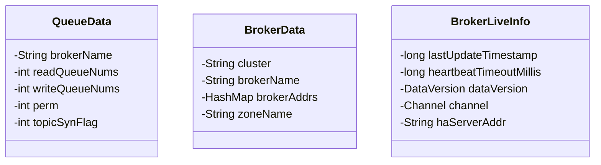

# 第2节 NameServer的路由管理机制


> 生产者在生产消息、消费者在消费消息之前，都需要连接到 NameServer 上，从 NameServer 拉取路由信息，从而实现消息的生产、存储与消费。为生产者和消费者提供路由信息，是 NameServer 的主要功能之一，NameServer 内部由一个路由管理器维护着路由信息，并且可以动态地管理 Broker 节点信息，包含注册、剔除、发现及心跳等。本文将着重介绍 NameServer 的路由管理机制，文章中使用到的代码均来自 RocketMQ 5.0 版本，感兴趣的读者可以 clone 下来阅读源码与注释。文中的代码仓库地址：[点击跳转](https://github.com/itlemon/rocketmq-5.0.0)。

## 一、路由信息数据结构分析

NameServer 是保证消息正确地从生产者到消费者的“指挥官”，它提供了路由管理，服务注册与服务发现、故障剔除等机制，这些机制的背后原理都都依赖于 NameServer 的路由功能，接下来，将详细介绍路由信息的数据结构，并按照 2m-2s 部署方式部署两组 Broker，通过打断点的形式一起看看 Broker 数据在路由管理器中是如何存储的，方便大家理解 NameServer 的路由原理。

### 1.1 路由信息数据结构分析

NameServer 有一个路由信息管理器 `RouteInfoManager`，它位于 `org.apache.rocketmq.namesrv.routeinfo` 包内，其内部存储了 topic 与 broker 的各种信息与关系，是 NameServer 实现服务注册与发现、故障剔除的基础。RouteInfoManager 内部维护了多个 Map 数据结构，用于存储路由信息，具体的内容如下所示：

```java
/**
 * 该容器存储的是topic与该topic相关的broker的Queue的数据
 * 例如某个RocketMQ集群是按照2m-2s部署的，那么这个集群上所有的topic，它对应的Map<String, QueueData>，在集群正常的情况下，
 * 都将有两条数据，键分别是broker-a、broker-b，QueueData记录topic在broker上的分区数等信息
 */
private final Map<String/* topic */, Map<String/* brokerName */, QueueData>> topicQueueTable;

/**
 * 该容器存储的是每个brokerName与broker的关系，例如某个RocketMQ集群是按照2m-2s部署的，那么有两组broker，brokerName分别
 * 是：broker-a、broker-b，这两组broker各有一个主和从，主的ID是0，从的ID是1，那么BrokerData里将记录集群名、主从broker实例
 * 的地址，zone名称等
 */
private final Map<String/* brokerName */, BrokerData> brokerAddrTable;

/**
 * 该容器存储的是集群名与brokerName的关系，也就是集群与Broker名称的映射表，可以方便知道一个集群下有哪些Broker
 */
private final Map<String/* clusterName */, Set<String/* brokerName */>> clusterAddrTable;

/**
 * 该容器存储的是每个broker实例的存活信息，NameServer每次收到心跳后会将此引用指向最新的表
 */
private final Map<BrokerAddrInfo/* brokerAddr */, BrokerLiveInfo> brokerLiveTable;

/**
 * 该容器存储的是Broker与Filter Server之间的关系
 */
private final Map<BrokerAddrInfo/* brokerAddr */, List<String>/* Filter Server */> filterServerTable;

/**
 * 该容器存储的是topic与该topic相关的broker中的Queue的映射信息
 */
private final Map<String/* topic */, Map<String/*brokerName*/, TopicQueueMappingInfo>> topicQueueMappingInfoTable;
```

从上面的数据结构看来，维护 NameServer 的路由信息应该还是很简单的，没有太过于抽象的概念，从数据结构中可以分析出来如下内容：

- 一个 Topic 包含多少个队列（Queue，有时候也成为分区，Partition），这个是和部署了多少组 Broker （主从算一组）有关，例如本文的案例部署方式是 2m-2s，就是两组 Broker，那么一个 Topic 拥有的分区数一定是 $2$ 的整数倍，一个 Broker 默认为每一个 Topic 创建 $4$ 个读队列和 $4$ 个写队列，Topic 的分区信息是存储在 `topicQueueTable` 中。
- 一组 Broker 有一个主，可以有多个从，它们拥有同样的 BrokerName，主从之间使用 brokerId 来进行区分，`brokerId=0` 代表主节点，`brokerId>0` 表示从节点，`brokerAddrTable` 维护了 BrokerName 对应的一组 Broker 集群信息，在 BrokerData 内部维护了一个 HashMap 结构来存储主从 Broker 节点，键是 brokerId，值是 Broker 节点的 IP 地址及端口信息。
- `clusterAddrTable` 维护了群名与 BrokerName 的关系，也就是集群与 Broker 名称的映射表，可以方便知道一个集群下有哪些 Broker。
- `brokerLiveTable` 存储的是每个 Broker 实例的存活信息，NameServer 每次收到心跳后会将此引用指向最新的表，该数据结构用来维护 Broker 的存活信息。
- `filterServerTable` 是 Broker 与 Filter Server 之间的关系。
- `topicQueueMappingInfoTable` 存储的是 Topic 与该 Topic 相关的 Broker 中的 Queue 的映射信息。

其中 QueueData、BrokerData、BrokerLiveInfo、TopicQueueMappingInfo 分别用于存储队列信息、Broker 信息、Broker 存活信息以及 Topic 与 Queue 映射信息等数据，其类图如下所示：



QueueData 中各个属性含义如下所示：

- brokerName：当前 Queue 所属的 Broker 的名称
- readQueueNums：读 Queue 的数量
- writeQueueNums：写 Queue 的数量
- perm：读写权限，{@link org.apache.rocketmq.common.constant.PermName}
- topicSynFlag：Topic 同步标记，{@link org.apache.rocketmq.common.sysflag.TopicSysFlag}

BrokerData 中各个属性含义如下所示：

- cluster：所属集群名称
- brokerName：Broker 名称
- brokerAddrs：主备 Broker 信息表，键为 BrokerID，值为 Broker 的地址
- zoneName：RocketMQ 5.0 新特性，支持多 zone 部署

BrokerLiveInfo 中各个属性含义如下所示：

- lastUpdateTimestamp：上一次更新的时间戳，用于判断该 Broker 是否已经过期，默认的 Broker 心跳过期时间是 $2$ 分钟
- heartbeatTimeoutMillis：心跳超时时间，默认是 $2$ 分钟，如果上一次更新时间戳加上心跳超时时间小于当前时间戳，那么说明该 Broker 过期了，需要被剔除。
- dataVersion：Broker 信息版本，记录 Broker 的状态
- channel：Socket 通道
- haServerAddr：haServer 的地址，是 Slave 从 Master 拉取数据时链接的地址

### 1.2 路由信息真实存储状况

文章《[NameServer的启动原理](./2-1NameServer的启动原理.md)》第一张图是一个 $2$ 主 $2$ 从的集群部署方式，集群中包含 $2$ 个 Master 的 Broker 和 $2$ 个 Slave 的 Broker，使用 BrokerData 存储上述部署方式，其表现为以下形式：


我们启动一个 NameServer 服务，并且启动四个 Broker 服务（分别是 BrokerStartup-am、BrokerStartup-as、BrokerStartup-bm、BrokerStartup-bs )，按照上面的图展示的方式来进行部署，一起验证一下 RouteInfoManager 内部的数据存储的内容。

为了可以在本机 IntelliJ IDEA 中启动四个 Broker 实例，我们需要为这四个 Broker 实例设置独立的 `ROCKETMQ_HOME`，一般企业生产环境，各个 Broker 基本独立部署在独立的物理机中，真实生产环境， `ROCKETMQ_HOME` 可以是一样的，但是本篇文章的验证案例，是需要在同一台机器上部署，所以各个 Broker 实例的 `ROCKETMQ_HOME` 要设置为不一样的。另外，Broker 默认的监听端口是 $10911$，我们也需要在配置文件 `broker.conf` 配置一下启动端口，将将每个 Broker 实例配置成不同的端口，这样可以防止各个 Broker 因端口占用而无法启动。

对于各个 Broker 独立的 `ROCKETMQ_HOME`，我们可以在之前配置的目录下新建四个目录 broker-am、broker-as、broker-bm、broker-bs，作为四个 Broker 实例的 `ROCKETMQ_HOME`，再在每个目录下新建 conf 目录用于存储 Broker 配置文件，新建 logs 目录用于存放日志，新建 store 目录用于存储 Broker 数据。笔者已按照上图的配置方式配置四个配置文件，这四个配置文件我已经放在 [Github](https://github.com/itlemon/rocketmq-5.0.0/tree/master/distribution/conf/custom) 上，读者可以拷贝下来，修改一下 `ROCKETMQ_HOME` 路径即可使用。

到目前为止，我们四个 Broker 实例的配置文件、ROCKETMQ_HOME、自定义端口都已经完成，接下来在 IDEA 中配置启动面板，这里给出一个示例：


尤其要注意图中展示红框标记的地方，每个 Broker 要指向对应的配置文件，配置文件中 Broker 自定义启动端口（默认是 $10911$，需要在同一机器启动多个 Broker 服务，需要自定义端口设置），需要注意的一点是，如果设置的 broker-am 的启动端口是 $10911$，那么 broker-as 的不能设置为 $10912$，因每个 Broker 启动后还会占用启动端口的后一个端口。笔者使用端口分别是 $10911$、$10921$、$10931$、$10941$，读者可以根据自己的想法设置即可。

我们首先启动 NameServer，这里为了演示方便，启动一个 NameServer 即可，然后依次启动四个 Broker 服务，最后在启动完 broker-bs 后，给 NameServer 的 RouteInfoManager 中的 registerBroker 方法加上断点，因为 Broker 向 NameServer 发送心跳的时候会调用这个方法来维护路由表，加上断点后可以很方便地查看运行时数据。

#### 1.2.1 topicQueueTable的数据状况


这是在四个 Broker 实例启动后，向 NameServer 注册的 Topic 信息，这些 Topic 除了 testCluster、broker-a、broker-b 以外，其他的都是系统预定义的 Topic，例如 `RMQ_SYS_TRANS_OP_HALF_TOPIC` 用来存放半事务消息，`SCHEDULE_TOPIC_XXXX` 用来存放延时消息等等。

上面有一个特殊 Topic：`TBW102`，我们在这里简单介绍一下它，后面在 Producer 发送消息的文章中还会提到它。它的作用很重要，当 Producer 在发送消息时，默认情况下，不需要提前创建好 Topic，如果 Topic 不存在，Broker 会自动创建 Topic。但是新创建的 Topic 它的权限是什么？读写队列数是多少呢？这个时候就需要用到 `TBW102` 了，RocketMQ会基于该 Topic 的配置创建新的 Topic。这里基本的时序图如下所示：

```sequence
DefaultMQProducer ->> DefaultMQProducer: 发送消息send(Topic, Message)
DefaultMQProducer ->> NameServer: 第一次拉取TopicPublishInfo
NameServer -->> DefaultMQProducer: Topic不存在
DefaultMQProducer ->> NameServer: 第二次拉取TopicPublishiInfo，<br/>此时拉取的是TBW102的路由信息
NameServer -->> DefaultMQProducer: 返回TBW102的路由信息
Note left of DefaultMQProducer: 1.Producer根据TBW102的路由信息构建TopicPublishInfo<br/>2.将TopicPublishInfo缓存到本地<br/>3.按照路由信息发送消息
DefaultMQProducer ->> SendMessageProcessor: 发送消息，并携带defaultTopic=TBW102
SendMessageProcessor ->> SendMessageProcessor: 消息检查msgCheck()
Note left of SendMessageProcessor: 消息校验：<br/>1.Topic合法性校验<br/>2.Topic不存在，自动创建
SendMessageProcessor ->> TopicConfigManager: 创建Topic
TopicConfigManager ->> TopicConfigManager: createTopicInSendMessageMethod()
Note left of TopicConfigManager: 1.基于TBW102的配置创建Topic<br/>2.发送心跳信息给NameServer，<br/>携带上新的Topic信息完成注册
DefaultMQProducer ->> SendMessageProcessor: 后续再发送消息，Topic路由信息就已经有了
```

根据时序图，我们一起总结下流程：Producer 发送一个不存在的 Topic 消息时，首先会从 NameServer 拉取 Topic 的路由信息，第一次拉取必然失败，第二次会直接拉取 TBW102 的路由数据，基于它创建 TopicPublishInfo 并缓存到本地，进行正常的消息发送，在 Header 里将 defaultTopic 设置为 TBW102。Broker 接收到消息时，先对消息做见检查，检查到 Topic 不存在，会基于 defaultTopic 的配置去创建该 Topic，然后注册到 NameServer 上，这样一个全新的Topic就被自动创建了。

我们理解了 Topic：TBW102 的作用，那么我们接下来就使用这个 Topic 来描述 NameServer 的路由信息。

上图中 topicQueueTable 对应于运行时的数据结构如下所示（这里只列出 TBW102 的数据）：

```json
{
    "TBW102":{
        "broker-b":{
            "brokerName":"broker-b",
            "readQueueNums":8,
            "writeQueueNums":8,
            "perm":7,
            "topicSysFlag":0
        },
        "broker-a":{
            "brokerName":"broker-a",
            "readQueueNums":8,
            "writeQueueNums":8,
            "perm":7,
            "topicSysFlag":0
        }
    }
}
```

#### 1.2.2 brokerAddrTable的数据状况


上图中 brokerAddrTable 对应于运行时的数据结构如下所示：

```json
{
    "broker-b":{
        "cluster":"testCluster",
        "brokerName":"broker-b",
        "brokerAddrs":{
            "0":"192.168.1.25:10931",
            "1":"192.168.1.25:10941"
        },
        "enableActingMaster":false
    },
    "broker-a":{
        "cluster":"testCluster",
        "brokerName":"broker-a",
        "brokerAddrs":{
            "0":"192.168.1.25:10911",
            "1":"192.168.1.25:10921"
        },
        "enableActingMaster":false
    }
}
```

#### 1.2.3 clusterAddrTable的数据状况

上图中 clusterAddrTable 对应于运行时的数据结构如下所示：

```json
{
	"testCluster": {
		"broker-b": "DEFAULT_OBJECT",
		"broker-a": "DEFAULT_OBJECT"
	}
}
```

这里需要说明一点，HashSet 底层的实现结构仍然是 HashMap，所以这里使用 HashMap 的方式来展示 HashSet，读者关心 Map 的键即可。

#### 1.2.4 brokerLiveTable的数据状况


上图中 brokerLiveTable，它是一个 Map 结构，Map 的键是 BrokerAddrInfo 对象，Map 的值是 BrokerLiveInfo 对象，在运行时，键的数据结构为：

```json
{
    "clusterName":"testCluster",
    "brokerAddr":"192.168.1.25:10911",
    "hash":-1235770154
}
```

为了方便展示，将键简化展示在下面的运行时数据结构中：

```json
{
    "192.168.1.25:10911":{
        "lastUpdateTimestamp":1678288800134,
        "heartbeatTimeoutMillis":120000,
        "dataVersion":"dataVersionObject",
        "channel":"channelObject",
        "haServerAddr":"192.168.1.25:10912"
    },
    "192.168.1.25:10921":{
        "lastUpdateTimestamp":1678288807815,
        "heartbeatTimeoutMillis":120000,
        "dataVersion":"dataVersionObject",
        "channel":"channelObject",
        "haServerAddr":"192.168.1.25:10922"
    },
    "192.168.1.25:10931":{
        "lastUpdateTimestamp":1678288813012,
        "heartbeatTimeoutMillis":120000,
        "dataVersion":"dataVersionObject",
        "channel":"channelObject",
        "haServerAddr":"192.168.1.25:10932"
    },
    "192.168.1.25:10941":{
        "lastUpdateTimestamp":1678288816376,
        "heartbeatTimeoutMillis":120000,
        "dataVersion":"dataVersionObject",
        "channel":"channelObject",
        "haServerAddr":"192.168.1.25:10942"
    }
}
```

上面的 brokerLiveTable 中，存储的就是两组 Broker 共 $4$ 个实例注册到 NameServer 的存活信息，在探活机制中，NameServer 会检查每一个 Broker 实例，上一次更新时间戳（lastUpdateTimestamp）加上心跳超时时间（heartbeatTimeoutMillis，默认值为 $2$ 分钟），如果结果小于当前时间戳，则认为该 Broker 实例不再活跃了，将触发剔除操作，关闭通道等。

## 二、路由信息管理原理分析

### 2.1 路由信息注册

路由信息注册通常是指，将自身的信息告诉服务注册中心，这里的“自身”是指 Broker，而服务注册中心指得就是 NameServer。Broker 在启动后，会向所有的 NameServer 注册自身的元信息，通常包括：集群名称（clusterName）、Broker 地址（brokerAddr）、Broker 名称（brokerName）、Broker ID（brokerId）、高可用地址（haServerAddr）、Topic相关信息（topicConfigWrapper）、过滤服务器列表、通信通道等信息等。这些元信息的注册，都是通过心跳机制来实现的，所谓的心跳机制，一般都是通过定时任务来实现的，按照一定的频率向NameServer 发送元信息数据，从而实现续约。每个 Broker 会每隔 $30$ 秒向 NameServer 发送心跳，NameServer 接收到 Broker 心跳数据后，会去实时更新 brokerLiveTable 中 BrokerLiveInfo 的 lastUpdateTimestamp 字段（上一次心跳时间戳），当然，NameServer 也有检查机制，会每隔 $10$ 秒扫描 brokerLiveTable，如果发现某个 Broker 的 lastUpdateTimestamp 字段超过 $2$min 没有更新，那么就认为该 Broker 存在故障，NameServer 会主动将其从路由表中剔除，同时关闭通信通道。

那么 Broker 是如何向 NameServer 进行注册的呢？下面的内容将一一揭秘。本文中代码片段均来自 [代码仓库](https://github.com/itlemon/rocketmq-5.0.0)，Broker 启动相关代码不再全量引入进来，启动原理主要部分代码均有注释，读者可以自行前往阅读。

从 BrokerController 的 start() 方法可以看出，Broker 在启动的时候，会注册一个定时任务，每隔 $30$s（默认值，可配置 $10$~$60$s）向 NameServer 发送元数据信息。`brokerConfig.getRegisterNameServerPeriod()`的默认值是 $30$s。

```java
// 注册一个定时任务，默认每隔30s向NameServer发送元数据信息，发送元数据信息的间隔可以设置10s到60s
scheduledFutures.add(this.scheduledExecutorService.scheduleAtFixedRate(new AbstractBrokerRunnable(this.getBrokerIdentity()) {
    @Override
    public void run2() {
        try {
            // broker支持延迟注册到NameServer，如果还没到时间，那么将不会去注册
            if (System.currentTimeMillis() < shouldStartTime) {
                BrokerController.LOG.info("Register to namesrv after {}", shouldStartTime);
                return;
            }
            
            // 如果broker是独立的，那么无需注册到NameServer
            if (isIsolated) {
                BrokerController.LOG.info("Skip register for broker is isolated");
                return;
            }
          
            // 注册逻辑在registerBrokerAll方法中
            BrokerController.this.registerBrokerAll(true, false, brokerConfig.isForceRegister());
        } catch (Throwable e) {
            BrokerController.LOG.error("registerBrokerAll Exception", e);
        }
    }
}, 1000 * 10, Math.max(10000, Math.min(brokerConfig.getRegisterNameServerPeriod(), 60000)), TimeUnit.MILLISECONDS));
```

具体的注册行为代码需要进入到 registerBrokerAll 方法中，这里将分析后的 registerBrokerAll 方法贴在下面：

```java
/**
 * 注册Broker元信息到NameServer列表中
 *
 * @param checkOrderConfig 是否检查顺序消息配置
 * @param oneway 是否是单向消息，如果是，那么就不需要知道注册结果，不同于同步和异步消息
 * @param forceRegister 是否是强制注册
 */
public synchronized void registerBrokerAll(final boolean checkOrderConfig, boolean oneway, boolean forceRegister) {

    // 创建一个TopicConfig和TopicQueueMapping相关的包装类对象
    TopicConfigAndMappingSerializeWrapper topicConfigWrapper = new TopicConfigAndMappingSerializeWrapper();

    // 包装版本对象和系统自带的一些Topic配置信息，具体有哪些Topic，可以从TopicValidator类中看到
    topicConfigWrapper.setDataVersion(this.getTopicConfigManager().getDataVersion());
    topicConfigWrapper.setTopicConfigTable(this.getTopicConfigManager().getTopicConfigTable());

    // 包装TopicQueueMapping相关的映射信息
    topicConfigWrapper.setTopicQueueMappingInfoMap(this.getTopicQueueMappingManager().getTopicQueueMappingTable().entrySet().stream().map(
        entry -> new AbstractMap.SimpleImmutableEntry<>(entry.getKey(), TopicQueueMappingDetail.cloneAsMappingInfo(entry.getValue()))
    ).collect(Collectors.toMap(Map.Entry::getKey, Map.Entry::getValue)));

    // 如果Broker只有读权限或者写权限，那么需要将Topic的权限设置为和Broker相同
    if (!PermName.isWriteable(this.getBrokerConfig().getBrokerPermission())
        || !PermName.isReadable(this.getBrokerConfig().getBrokerPermission())) {
        ConcurrentHashMap<String, TopicConfig> topicConfigTable = new ConcurrentHashMap<>();
        for (TopicConfig topicConfig : topicConfigWrapper.getTopicConfigTable().values()) {
            TopicConfig tmp =
                new TopicConfig(topicConfig.getTopicName(), topicConfig.getReadQueueNums(), topicConfig.getWriteQueueNums(),
                    topicConfig.getPerm() & this.brokerConfig.getBrokerPermission(), topicConfig.getTopicSysFlag());
            topicConfigTable.put(topicConfig.getTopicName(), tmp);
        }
        topicConfigWrapper.setTopicConfigTable(topicConfigTable);
    }

    // forceRegister默认情况下是true，如果为false，那么就需要调用needRegister来判断是否需要注册
    // needRegister内部逻辑也很简单，就是去请求所有的NameServer，判断NameServer存储的Broker信息
    // 是否和当前的Broker版本信息是否一致，如果是一致的，那么就不需要注册
    if (forceRegister || needRegister(this.brokerConfig.getBrokerClusterName(),
        this.getBrokerAddr(),
        this.brokerConfig.getBrokerName(),
        this.brokerConfig.getBrokerId(),
        this.brokerConfig.getRegisterBrokerTimeoutMills(),
        this.brokerConfig.isInBrokerContainer())) {
        // 注册Broker信息到NameServer的核心逻辑
        doRegisterBrokerAll(checkOrderConfig, oneway, topicConfigWrapper);
    }
}
```

在 doRegisterBrokerAll 方法内，最主要的就是调用 brokerOuterAPI 的 registerBrokerAll 接口来向 NameServer 进行注册。

```java
// 注册Broker信息到NameServer的核心逻辑
List<RegisterBrokerResult> registerBrokerResultList = this.brokerOuterAPI.registerBrokerAll(
    this.brokerConfig.getBrokerClusterName(),
    this.getBrokerAddr(),
    this.brokerConfig.getBrokerName(),
    this.brokerConfig.getBrokerId(),
    this.getHAServerAddr(),
    topicConfigWrapper,
    this.filterServerManager.buildNewFilterServerList(),
    oneway,
    this.brokerConfig.getRegisterBrokerTimeoutMills(),
    this.brokerConfig.isEnableSlaveActingMaster(),
    this.brokerConfig.isCompressedRegister(),
    this.brokerConfig.isEnableSlaveActingMaster() ? this.brokerConfig.getBrokerNotActiveTimeoutMillis() : null,
    this.getBrokerIdentity());
```

registerBrokerAll 方法的主要逻辑就是遍历每一个 NameServer 服务地址，然后分别向每一个 NameServer 进行注册操作，具体代码如下所示：

```java
public List<RegisterBrokerResult> registerBrokerAll(
        final String clusterName,
        final String brokerAddr,
        final String brokerName,
        final long brokerId,
        final String haServerAddr,
        final TopicConfigSerializeWrapper topicConfigWrapper,
        final List<String> filterServerList,
        final boolean oneway,
        final int timeoutMills,
        final boolean enableActingMaster,
        final boolean compressed,
        final Long heartbeatTimeoutMillis,
        final BrokerIdentity brokerIdentity) {

    // 封装注册结果的容器
    final List<RegisterBrokerResult> registerBrokerResultList = new CopyOnWriteArrayList<>();

    // 获取NameServer列表
    List<String> nameServerAddressList = this.remotingClient.getAvailableNameSrvList();
    if (nameServerAddressList != null && nameServerAddressList.size() > 0) {
        // 构建注册Broker信息的请求头对象
        final RegisterBrokerRequestHeader requestHeader = new RegisterBrokerRequestHeader();
        // 将Broker的主要元信息存储到请求头中
        requestHeader.setBrokerAddr(brokerAddr);
        requestHeader.setBrokerId(brokerId);
        requestHeader.setBrokerName(brokerName);
        requestHeader.setClusterName(clusterName);
        requestHeader.setHaServerAddr(haServerAddr);
        requestHeader.setEnableActingMaster(enableActingMaster);
        requestHeader.setCompressed(false);
        // 该参数要特殊说明一下：只有当enableActingMaster为true的时候才生效（在container模式下），这个心跳超时默认时间是10s，
        if (heartbeatTimeoutMillis != null) {
            requestHeader.setHeartbeatTimeoutMillis(heartbeatTimeoutMillis);
        }

        // 构建注册Broker信息的请求体
        RegisterBrokerBody requestBody = new RegisterBrokerBody();

        // 将topic配置信息及过滤器服务信息数据封装到请求体中
        requestBody.setTopicConfigSerializeWrapper(TopicConfigAndMappingSerializeWrapper.from(topicConfigWrapper));
        requestBody.setFilterServerList(filterServerList);

        // 将请求体进行编码（是否进行gzip压缩，默认为false）
        final byte[] body = requestBody.encode(compressed);
        final int bodyCrc32 = UtilAll.crc32(body);
        requestHeader.setBodyCrc32(bodyCrc32);

        // 创建计数器，用来计数完成注册的数量
        final CountDownLatch countDownLatch = new CountDownLatch(nameServerAddressList.size());

        // 遍历所有的NameServer地址，分别向每一个NameServer进行注册
        for (final String namesrvAddr : nameServerAddressList) {
            brokerOuterExecutor.execute(new AbstractBrokerRunnable(brokerIdentity) {
                @Override
                public void run2() {
                    try {

                        // 注册Broker，底层调用netty客户端发送请求到NameServer
                        RegisterBrokerResult result = registerBroker(namesrvAddr, oneway, timeoutMills, requestHeader, body);

                        // 将注册结果添加到结果列表中
                        if (result != null) {
                            registerBrokerResultList.add(result);
                        }

                        LOGGER.info("Registering current broker to name server completed. TargetHost={}", namesrvAddr);
                    } catch (Exception e) {
                        LOGGER.error("Failed to register current broker to name server. TargetHost={}", namesrvAddr, e);
                    } finally {
                        countDownLatch.countDown();
                    }
                }
            });
        }

        try {
            // 完成所有注册的默认超时时间是24s，如果在24s内没有完成注册，那么就打印该日志
            if (!countDownLatch.await(timeoutMills, TimeUnit.MILLISECONDS)) {
                LOGGER.warn("Registration to one or more name servers does NOT complete within deadline. Timeout threshold: {}ms", timeoutMills);
            }
        } catch (InterruptedException ignore) {
        }
    }

    return registerBrokerResultList;
}
```

分别向每一个 NameServer 注册时候，调用的都是同一个方法：registerBroker，底层调用的都是由 Netty 封装的远程连接，通过请求码来获取远程调用连接，将注册信息发送过去。注册 Broker 使用到的请求码是 `RequestCode.REGISTER_BROKER`，不同的需求使用的请求码是不一样的，比如注销 Broker 使用到的是 `RequestCode.UNREGISTER_BROKER`。

```java
private RegisterBrokerResult registerBroker(
        final String namesrvAddr,
        final boolean oneway,
        final int timeoutMills,
        final RegisterBrokerRequestHeader requestHeader,
        final byte[] body
) throws RemotingCommandException, MQBrokerException, RemotingConnectException, RemotingSendRequestException, RemotingTimeoutException,
        InterruptedException {

    // 根据请求码RequestCode.REGISTER_BROKER获取注册Broker信息的远程连接请求对象
    RemotingCommand request = RemotingCommand.createRequestCommand(RequestCode.REGISTER_BROKER, requestHeader);
    request.setBody(body);

    // 如果是单向消息，也就是不管注册结果如何，它调用invokeOneway方法来进行注册
    if (oneway) {
        try {
            this.remotingClient.invokeOneway(namesrvAddr, request, timeoutMills);
        } catch (RemotingTooMuchRequestException e) {
            // Ignore
        }
        return null;
    }

    // 同步注册，也就是阻塞等待注册结果
    RemotingCommand response = this.remotingClient.invokeSync(namesrvAddr, request, timeoutMills);
    assert response != null;
    switch (response.getCode()) {
        case ResponseCode.SUCCESS: {
            // 解析注册结果
            RegisterBrokerResponseHeader responseHeader =
                    (RegisterBrokerResponseHeader) response.decodeCommandCustomHeader(RegisterBrokerResponseHeader.class);
            RegisterBrokerResult result = new RegisterBrokerResult();
            result.setMasterAddr(responseHeader.getMasterAddr());
            result.setHaServerAddr(responseHeader.getHaServerAddr());
            if (response.getBody() != null) {
                result.setKvTable(KVTable.decode(response.getBody(), KVTable.class));
            }
            return result;
        }
        default:
            break;
    }

    throw new MQBrokerException(response.getCode(), response.getRemark(), requestHeader == null ? null : requestHeader.getBrokerAddr());
}
```

再往底层分析就是涉及到 Netty 的知识了，本文主要围绕 RocketMQ 来进行源码分析，对于 Netty，后续将通过其他的文章来讨论。以上内容就是 Broker 在启动的过程中向指定的 NameServer 注册元信息的流程分析。

Broker 向指定的 NameServer 发送了心跳，NameServer 接收到心跳后是如何处理的呢？本节中第一小节路由信息管理器中阐述了 Broker 发送过来的心跳数据是以何种形式存储在路由管理器中，接下来将解析路由信息维护的源代码，方便大家弄清楚其中的原理。

NameServer 在初始化的时候，注册了一个处理器 DefaultRequestProcessor，专门用于处理网络请求，已经没有印象的读者可以去文章的开始处看 NamesrvController 的 initialize 方法。当远程的注册请求到达的时候，都会由 DefaultRequestProcessor 的 processRequest 方法来进行处理，该方法其实就是起到了路由的作用，内部根据请求码来判断该调用哪个 API 来进行具体的操作，对于 Broker 注册元信息，其实就是转发给 RouteInfoManager 的registerBroker 方法来进行处理的。

```java
/**
 * 注册Broker
 *
 * @param clusterName broker集群名称，来自broker.conf中配置的属性brokerClusterName的值
 * @param brokerAddr broker地址
 * @param brokerName broker名称，来自broker.conf中配置的属性brokerName的值
 * @param brokerId broker ID，来自broker.conf中配置的属性brokerId的值
 * @param haServerAddr ha server地址
 * @param topicConfigWrapper topic配置包装类对象
 * @param filterServerList filter server列表
 * @param channel netty channel
 * @return RegisterBrokerResult 注册Broker结果
 */
public RegisterBrokerResult registerBroker(
        final String clusterName,
        final String brokerAddr,
        final String brokerName,
        final long brokerId,
        final String haServerAddr,
        final TopicConfigSerializeWrapper topicConfigWrapper,
        final List<String> filterServerList,
        final Channel channel) {
    // 封装注册Broker的结果实体类
    RegisterBrokerResult result = new RegisterBrokerResult();
    try {
        try {
            // 第一步：获取一个写锁，防止并发修改路由表中的数据导致异常
            this.lock.writeLock().lockInterruptibly();

            // 第二步：维护集群与BrokerName的路由表（关系表）
            // 如果clusterAddrTable中集群名对应的brokerName集合存在，那么就直接存入，否则创建一个新的HashSet后存入
            Set<String> brokerNames = this.clusterAddrTable.computeIfAbsent(clusterName, k -> new HashSet<>());
            brokerNames.add(brokerName);

            // 标记是否为第一次注册为false
            boolean registerFirst = false;

            // 第三步：维护brokerName和brokerData的路由表（关系表）
            // 根据brokerName来获取brokerData数据，如果brokerData不存在，那么可认为该Broker这是第一次注册
            BrokerData brokerData = this.brokerAddrTable.get(brokerName);
            if (null == brokerData) {
                registerFirst = true;
                brokerData = new BrokerData(clusterName, brokerName, new HashMap<>());
                this.brokerAddrTable.put(brokerName, brokerData);
            }
            // 下面的这段代码其实我个人更加愿意将其使用代码块封装起来，其作用就是如果注册的Broker的ID发生了变化，
            // 那么将原有注册的brokerAddr删除，再重新将新的信息存入到brokerData中的brokerAddrs
            // 具体的可看下面的英文描述，也就是切换slave的broker为master的操作
            Map<Long, String> brokerAddrsMap = brokerData.getBrokerAddrs();
            //Switch slave to master: first remove <1, IP:PORT> in namesrv, then add <0, IP:PORT>
            //The same IP:PORT must only have one record in brokerAddrTable
            brokerAddrsMap.entrySet().removeIf(
                    item -> null != brokerAddr && brokerAddr.equals(item.getValue()) && brokerId != item.getKey());

            // 将broker信息存入到brokerData的表brokerAddrs中
            String oldAddr = brokerData.getBrokerAddrs().put(brokerId, brokerAddr);
            // 如果返回的oldAddr为null，则说明新存入的，表brokerAddrs不存在键为brokerId的数据，这种也认为是第一次注册
            registerFirst = registerFirst || (null == oldAddr);

            // 第四步：判断是否需要更新topicConfig信息，只有主Broker注册的时候（topicConfigWrapper始终不为空）才会去进一步判断
            if (null != topicConfigWrapper
                    && MixAll.MASTER_ID == brokerId) {
                // 如果是第一次注册，或者topicConfig的版本发生了变化，那么就需要更新
                // 第一次注册，其实带来的topic都是一些默认的topic信息，当生产者发送主题的时候，如果主题没有创建，且
                // brokerConfig中的字段autoCreateTopicEnable为true的时候，那么将返回默认的主题路由信息
                if (this.isBrokerTopicConfigChanged(brokerAddr, topicConfigWrapper.getDataVersion())
                        || registerFirst) {
                    ConcurrentMap<String, TopicConfig> tcTable =
                            topicConfigWrapper.getTopicConfigTable();
                    if (tcTable != null) {
                        for (Map.Entry<String, TopicConfig> entry : tcTable.entrySet()) {
                            // 第五步：维护topicQueueTable路由表，没有则创建QueueData，否则根据需要来更新
                            this.createAndUpdateQueueData(brokerName, entry.getValue());
                        }
                    }
                }
            }

            // 第六步：维护brokerLiveTable路由表，将broker的信息存入到表中
            BrokerLiveInfo prevBrokerLiveInfo = this.brokerLiveTable.put(brokerAddr,
                    new BrokerLiveInfo(
                            System.currentTimeMillis(),
                            topicConfigWrapper.getDataVersion(),
                            channel,
                            haServerAddr));
            // 如果返回的为null，则认为是将新的broker注册到表中
            if (null == prevBrokerLiveInfo) {
                log.info("new broker registered, {} HAServer: {}", brokerAddr, haServerAddr);
            }

            // 第七步：维护filterServerTable，这一块内容后续分析
            if (filterServerList != null) {
                if (filterServerList.isEmpty()) {
                    this.filterServerTable.remove(brokerAddr);
                } else {
                    this.filterServerTable.put(brokerAddr, filterServerList);
                }
            }

            // 第八步：如果是非master的broker注册，还需要将master的信息返回给broker端
            if (MixAll.MASTER_ID != brokerId) {
                String masterAddr = brokerData.getBrokerAddrs().get(MixAll.MASTER_ID);
                if (masterAddr != null) {
                    BrokerLiveInfo brokerLiveInfo = this.brokerLiveTable.get(masterAddr);
                    if (brokerLiveInfo != null) {
                        result.setHaServerAddr(brokerLiveInfo.getHaServerAddr());
                        result.setMasterAddr(masterAddr);
                    }
                }
            }
        } finally {
            // 第九步：释放写锁
            this.lock.writeLock().unlock();
        }
    } catch (Exception e) {
        log.error("registerBroker Exception", e);
    }

    return result;
}
```

以上的代码就是NameServer接收到Broker注册信息后维护路由表的代码，逻辑清晰明了，简单，设计中加入了写锁，保证了并发情况下的线程安全。读者直接阅读上述的代码注释就可以明白路由信息维护的流程及原理。

### 3.3 路由信息剔除

接下来我们继续一起探讨一下路由信息剔除的原理。在『3.2 路由信息注册』小节中，我们已经分析了部分路由信息剔除的原理：每个Broker会每隔30秒向NameServer发送心跳，NameServer接收到Broker心跳数据后，会去实时更新brokerLiveTable中BrokerLiveInfo的lastUpdateTimestamp字段（上一次心跳时间戳），当然，NameServer也有检查机制，会每隔10秒扫描brokerLiveTable，如果发现某个Broker的lastUpdateTimestamp字段超过2min没有更新，那么就认为该Broker存在故障，NameServer会主动将其从路由表中剔除，同时关闭通信通道。
对于RocketMQ来说，剔除路由信息主要有两个方式：

- 故障剔除：故障剔除就是某个Broker超过2min没有发送心跳给NameServer，那么NameServer就会认为该Broker发生了故障，就会主动将其剔除，并同时更新所有的路由表。
- 主动注销：Broker正常下线，向NameServer发送注销的请求，那么NameServer就会去实时更新全部路由表。

对于故障剔除和主动注销，底层使用到的代码是一样的，区别是前者是NameServer通过定时扫描，定期检查的方式来主动发现的，后者是Broker下线时主动发送注销请求告知NameServer的，在NameServer端处理方式是一样的。

**从故障剔除的角度来分析：**
NameServer在初始化的时候注册了一个定时任务，每隔10s扫描一次brokerLiveTable表，超过2min没有更新的Broker将被其剔除。

```java
// NameServer定时每隔10秒钟扫描一次Broker列表，移除已经处于非激活状态的Broker
this.scheduledExecutorService.scheduleAtFixedRate(
	NamesrvController.this.routeInfoManager::scanNotActiveBroker, 5, 10, TimeUnit.SECONDS);
```

这里需要重点关注RouteInfoManager的scanNotActiveBroker方法：

```java
/**
 * 扫描brokerLiveTable，将超过2min没有更新的Broker移除
 */
public void scanNotActiveBroker() {
    Iterator<Entry<String, BrokerLiveInfo>> it = this.brokerLiveTable.entrySet().iterator();
    while (it.hasNext()) {
        Entry<String, BrokerLiveInfo> next = it.next();
        long last = next.getValue().getLastUpdateTimestamp();
        // 上一次更新时间戳+120s小于当前时间戳说明Broker已经过期
        if ((last + BROKER_CHANNEL_EXPIRED_TIME) < System.currentTimeMillis()) {
            // 关闭通信通道
            RemotingUtil.closeChannel(next.getValue().getChannel());
            // 剔除broker
            it.remove();
            log.warn("The broker channel expired, {} {}ms", next.getKey(), BROKER_CHANNEL_EXPIRED_TIME);
            // 维护其他几个路由表
            this.onChannelDestroy(next.getKey(), next.getValue().getChannel());
        }
    }
}
```

当过期后，NameServer将Broker从brokerLiveTable剔除，并关闭了通信通道，其他路由表的维护则依赖onChannelDestroy方法。

```java
/**
 * 移除topicQueueTable brokerAddrTable clusterAddrTable中关于制定Broker的路由信息
 *
 * @param remoteAddr Broker的地址
 * @param channel 通信通道
 */
public void onChannelDestroy(String remoteAddr, Channel channel) {
    String brokerAddrFound = null;
    // 该方法不仅仅是在清理路由表的信息的时候调用，NameServer在定期检查长连接的时候也会去调用
    // 所以下面的这个if代码块是在定期检查长连接的时候用到
    if (channel != null) {
        try {
            try {
                this.lock.readLock().lockInterruptibly();
                Iterator<Entry<String, BrokerLiveInfo>> itBrokerLiveTable =
                        this.brokerLiveTable.entrySet().iterator();
                while (itBrokerLiveTable.hasNext()) {
                    Entry<String, BrokerLiveInfo> entry = itBrokerLiveTable.next();
                    if (entry.getValue().getChannel() == channel) {
                        brokerAddrFound = entry.getKey();
                        break;
                    }
                }
            } finally {
                this.lock.readLock().unlock();
            }
        } catch (Exception e) {
            log.error("onChannelDestroy Exception", e);
        }
    }

    // 如果brokerAddrFound为null，那么说明brokerLiveTable已经不存在指定的Broker信息了
    if (null == brokerAddrFound) {
        brokerAddrFound = remoteAddr;
    } else {
        log.info("the broker's channel destroyed, {}, clean it's data structure at once", brokerAddrFound);
    }

    if (brokerAddrFound != null && brokerAddrFound.length() > 0) {

        try {
            try {
                // 正式清理路由表信息
                // 第一步：获取写锁，防止并发异常
                this.lock.writeLock().lockInterruptibly();
                // 第二步：根据brokerAddr，移除路由表brokerLiveTable和filterServerTable中指定的Broker信息
                this.brokerLiveTable.remove(brokerAddrFound);
                this.filterServerTable.remove(brokerAddrFound);
                String brokerNameFound = null;
                boolean removeBrokerName = false;
                // 第三步：开始清理brokerAddrTable中关于指定brokerAddr的信息
                // 如果brokerName对应的BrokerData中没有Broker的信息，也就是BrokerData中的Map的brokerAddrs
                // 为空，那么也要移除该brokerName对应的信息
                Iterator<Entry<String, BrokerData>> itBrokerAddrTable =
                        this.brokerAddrTable.entrySet().iterator();
                while (itBrokerAddrTable.hasNext() && (null == brokerNameFound)) {
                    BrokerData brokerData = itBrokerAddrTable.next().getValue();

                    Iterator<Entry<Long, String>> it = brokerData.getBrokerAddrs().entrySet().iterator();
                    while (it.hasNext()) {
                        Entry<Long, String> entry = it.next();
                        Long brokerId = entry.getKey();
                        String brokerAddr = entry.getValue();
                        if (brokerAddr.equals(brokerAddrFound)) {
                            brokerNameFound = brokerData.getBrokerName();
                            it.remove();
                            log.info("remove brokerAddr[{}, {}] from brokerAddrTable, because channel destroyed",
                                    brokerId, brokerAddr);
                            break;
                        }
                    }

                    if (brokerData.getBrokerAddrs().isEmpty()) {
                        removeBrokerName = true;
                        itBrokerAddrTable.remove();
                        log.info("remove brokerName[{}] from brokerAddrTable, because channel destroyed",
                                brokerData.getBrokerName());
                    }
                }
                
                // 第四步：清理clusterAddrTable中的brokerName信息，如果brokerName对应的没有存活的broker信息
                // 那么就需要在clusterAddrTable移除brokerName的信息
                if (brokerNameFound != null && removeBrokerName) {
                    Iterator<Entry<String, Set<String>>> it = this.clusterAddrTable.entrySet().iterator();
                    while (it.hasNext()) {
                        Entry<String, Set<String>> entry = it.next();
                        String clusterName = entry.getKey();
                        Set<String> brokerNames = entry.getValue();
                        boolean removed = brokerNames.remove(brokerNameFound);
                        if (removed) {
                            log.info(
                                    "remove brokerName[{}], clusterName[{}] from clusterAddrTable, because "
                                            + "channel destroyed",
                                    brokerNameFound, clusterName);

                            if (brokerNames.isEmpty()) {
                                log.info(
                                        "remove the clusterName[{}] from clusterAddrTable, because channel "
                                                + "destroyed and no broker in this cluster",
                                        clusterName);
                                it.remove();
                            }

                            break;
                        }
                    }
                }

                // 第五步：清理topicQueueTable中对应的QueueData信息，如果brokerName对应的
                // broker都已经被移除，那么就需要清理对应的Queue的信息
                if (removeBrokerName) {
                    Iterator<Entry<String, List<QueueData>>> itTopicQueueTable =
                            this.topicQueueTable.entrySet().iterator();
                    while (itTopicQueueTable.hasNext()) {
                        Entry<String, List<QueueData>> entry = itTopicQueueTable.next();
                        String topic = entry.getKey();
                        List<QueueData> queueDataList = entry.getValue();

                        Iterator<QueueData> itQueueData = queueDataList.iterator();
                        while (itQueueData.hasNext()) {
                            QueueData queueData = itQueueData.next();
                            if (queueData.getBrokerName().equals(brokerNameFound)) {
                                itQueueData.remove();
                                log.info("remove topic[{} {}], from topicQueueTable, because channel destroyed",
                                        topic, queueData);
                            }
                        }

                        if (queueDataList.isEmpty()) {
                            itTopicQueueTable.remove();
                            log.info("remove topic[{}] all queue, from topicQueueTable, because channel destroyed",
                                    topic);
                        }
                    }
                }
            } finally {
                // 第六步：必须释放锁资源
                this.lock.writeLock().unlock();
            }
        } catch (Exception e) {
            log.error("onChannelDestroy Exception", e);
        }
    }
}
```

从上面的代码看来逻辑思路还是非常简单明了的，NameServer的设计初衷就是为了让系统更加简单。

**从主动注销的角度来分析：**
在Broker正常启动的时候会注册一个shutDown的钩子函数，代码如下所示：

```java
// Broker在启动的时候会注册一个钩子函数，当Broker的进程收到退出进程的信号后会指定该函数
// 主要是执行controller.shutdown();来关闭资源链接已经清理NameServer中的路由信息等
Runtime.getRuntime().addShutdownHook(new Thread(new Runnable() {
            private volatile boolean hasShutdown = false;
            private final AtomicInteger shutdownTimes = new AtomicInteger(0);

            @Override
            public void run() {
                synchronized (this) {
                    log.info("Shutdown hook was invoked, {}", this.shutdownTimes.incrementAndGet());
                    if (!this.hasShutdown) {
                        this.hasShutdown = true;
                        long beginTime = System.currentTimeMillis();
                        controller.shutdown();
                        long consumingTimeTotal = System.currentTimeMillis() - beginTime;
                        log.info("Shutdown hook over, consuming total time(ms): {}", consumingTimeTotal);
                    }
                }
            }
        }, "ShutdownHook"));
```

`controller.shutdown();`中会执行`this.unregisterBrokerAll();`方法，主要是去主动注销NameServer中的路由信息，底层调用的还是`brokerOuterAPI.unregisterBrokerAll`的方法：

```java
/**
 * 注销NameServer中的路由信息
 *
 * @param clusterName 集群名称
 * @param brokerAddr broker地址
 * @param brokerName broker名称
 * @param brokerId broker ID
 */
public void unregisterBrokerAll(
        final String clusterName,
        final String brokerAddr,
        final String brokerName,
        final long brokerId
) {
    // 获取所有的NameServer列表
    List<String> nameServerAddressList = this.remotingClient.getNameServerAddressList();
    if (nameServerAddressList != null) {
        // 遍历NameServer列表并分别注销
        for (String namesrvAddr : nameServerAddressList) {
            try {
                this.unregisterBroker(namesrvAddr, clusterName, brokerAddr, brokerName, brokerId);
                log.info("unregisterBroker OK, NamesrvAddr: {}", namesrvAddr);
            } catch (Exception e) {
                log.warn("unregisterBroker Exception, {}", namesrvAddr, e);
            }
        }
    }
}
```

具体的注销逻辑和注册逻辑是类似的，首先构建请求头，将必要信息进行封装，然后根据请求码来获取连接，然后执行连接获取执行结果，具体代码如下所示：

```java
public void unregisterBroker(
        final String namesrvAddr,
        final String clusterName,
        final String brokerAddr,
        final String brokerName,
        final long brokerId
) throws RemotingConnectException, RemotingSendRequestException, RemotingTimeoutException, InterruptedException,
        MQBrokerException {
    // 第一步：封装注销Broker的请求头
    UnRegisterBrokerRequestHeader requestHeader = new UnRegisterBrokerRequestHeader();
    requestHeader.setBrokerAddr(brokerAddr);
    requestHeader.setBrokerId(brokerId);
    requestHeader.setBrokerName(brokerName);
    requestHeader.setClusterName(clusterName);
    // 第二步：根据请求码来获取连接
    RemotingCommand request = RemotingCommand.createRequestCommand(RequestCode.UNREGISTER_BROKER, requestHeader);

    // 第三步：执行连接请求
    RemotingCommand response = this.remotingClient.invokeSync(namesrvAddr, request, 3000);
    assert response != null;
    // 第四步：分析结果
    switch (response.getCode()) {
        case ResponseCode.SUCCESS: {
            return;
        }
        default:
            break;
    }

    throw new MQBrokerException(response.getCode(), response.getRemark());
}
```

这是Broker端主动注销的源码分析，当NameServer接收到注销请求后，会由NameServer的DefaultRequestProcessor根据请求码转发给RouteInfoManager的unregisterBroker方法来进行路由的删除维护操作，就和NameServer定期扫描的在底层使用的方法是一致的了。

### 3.4 路由信息发现

NameServer在设计之初就考虑将其设计得更加简单，NameServer中的路由信息在发生变化后，并不会主动推送给客户端（包括生产者和消费者），而是需要客户端主动拉取最新的路由信息。具体的请求码是`RequestCode.GET_ROUTEINFO_BY_TOPIC`，请求到达NameServer的DefaultRequestProcessor后，将转发给getRouteInfoByTopic方法来执行，具体的源码如下所示：

```java
/**
 * 根据Topic来获取路由信息
 *
 * @param ctx 上下文环境
 * @param request 请求内容
 * @return RemotingCommand对象
 * @throws RemotingCommandException 异常
 */
public RemotingCommand getRouteInfoByTopic(ChannelHandlerContext ctx,
        RemotingCommand request) throws RemotingCommandException {
    // 封装返回体和解析请求头
    final RemotingCommand response = RemotingCommand.createResponseCommand(null);
    final GetRouteInfoRequestHeader requestHeader =
            (GetRouteInfoRequestHeader) request.decodeCommandCustomHeader(GetRouteInfoRequestHeader.class);

    // 从RouteInfoManager中获取路由信息，并封装为TopicRouteData对象
    TopicRouteData topicRouteData =
            this.namesrvController.getRouteInfoManager().pickupTopicRouteData(requestHeader.getTopic());

    if (topicRouteData != null) {
        // 如果路由信息存在，且该主题配置的是顺序消息，那么就从NameServer的KVconfig中获取顺序消息相关的配置
        if (this.namesrvController.getNamesrvConfig().isOrderMessageEnable()) {
            String orderTopicConf =
                    this.namesrvController.getKvConfigManager()
                            .getKVConfig(NamesrvUtil.NAMESPACE_ORDER_TOPIC_CONFIG,
                                    requestHeader.getTopic());
            topicRouteData.setOrderTopicConf(orderTopicConf);
        }

        // 返回体编码并返回
        byte[] content = topicRouteData.encode();
        response.setBody(content);
        response.setCode(ResponseCode.SUCCESS);
        response.setRemark(null);
        return response;
    }

    // 在未找到路由信息的情况下返回如下信息
    response.setCode(ResponseCode.TOPIC_NOT_EXIST);
    response.setRemark("No topic route info in name server for the topic: " + requestHeader.getTopic()
            + FAQUrl.suggestTodo(FAQUrl.APPLY_TOPIC_URL));
    return response;
}
```

以上代码中主要的一行代码是：

```java
// 从RouteInfoManager中获取路由信息，并封装为TopicRouteData对象
TopicRouteData topicRouteData =
       this.namesrvController.getRouteInfoManager().pickupTopicRouteData(requestHeader.getTopic());
```

底层还是需要从RouteInfoManager获取路由表信息，最后将其封装为TopicRouteData返回给客户端。由于`pickupTopicRouteData`方法简单明了，读者可自行阅读并理解。

## 四、文章小结

本文从NameServer的启动流程开始分析，一步一步分析到本文的主要内容——路由管理器（RouteInfoManager），主要围绕路由信息的注册、剔除与发现，一步步分析后，我们发现原理其实很简单，RocketMQ就是这么喜人，性能强大的同时，让所有喜欢源码的朋友都能阅读得懂。总结来说就是：

- Broker在启动的时候向指定的NameServer进行注册，发送自身的元信息到NameServer的路由管理器；
- 路由信息的剔除则有主动注销和异常剔除两种情况，都是将路由信息从路由管理器中删除，NameServer端的底层处理方式都是一致的，只是触发的方式不一样而已，前者是NameServer主动扫描，后者是Broker主动发送注销请求；
- 获取路由信息则由客户端主动拉取，NameServer并不会主动推送。

思考：如果某个Broker发生了故障，并没有主动发起注销的请求，那么NameServer最少要等待2min才会得知并进行故障剔除，在这期间，生产者将消息发送到故障的Broker，那么就会造成发送失败，其实这是分布式系统中常见的高可用问题，那么RocketMQ是如何解决这种问题的呢？我们可以带着这个问题进入到下一节的源码分析《[RocketMQ源码之路（三）消息发送源码分析](https://itlemon.blog.csdn.net/article/details/113879541)》，欢迎来撩。